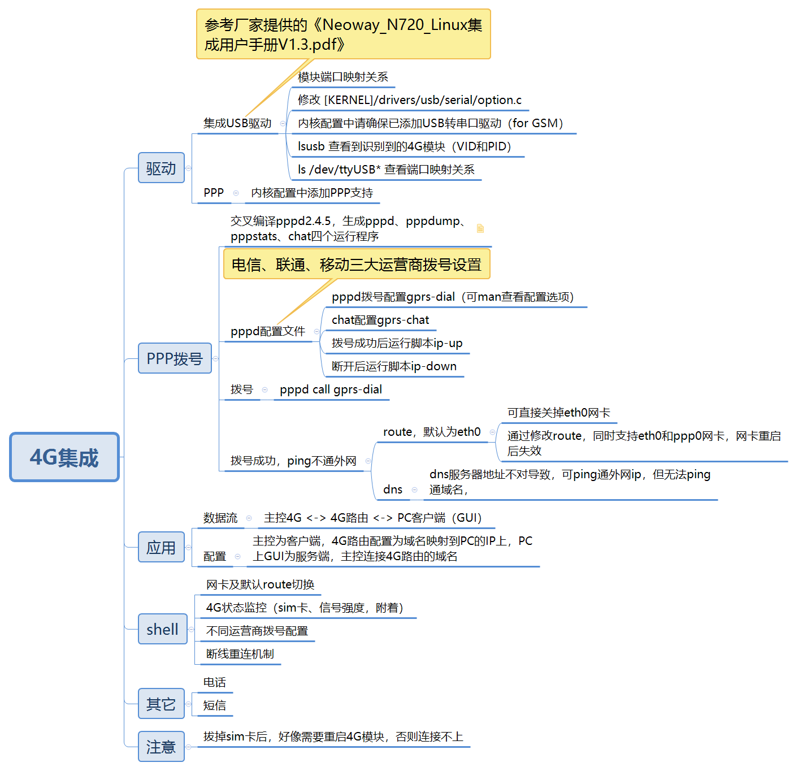

# 4g-notes
## 1.背景
```
    目前智能机在硬件上多采用双cpu的架构,一个是基带处理器,主要处理数字信号、语音信号的编码解码以及GSM通信协议,另一个是应用处理器,运行操作系统和各种应用程序。基带处理器、射频和其他外围芯片作为一个模块,成为GSM/GPRS modem,提供AT命令接口。
    从软件的角度来看,RIL(Radio interface Layer)工作在PPP、TCP/IP协议之下,负责数据的可靠传输、AT指令的发送以及response的解析。除了对网络的支持,RIL也支持SMS、Voice Call等功能。从这一点来看,RIL的性能好坏影响着所有无线通信应用相关的软件,而软件设计的合理性又影响着RIL的性能。
```
## 2.有方4G模块拨号方式(N720)
```
    拨号前,需查询卡状态,信号强度,数据业务附着状态,APN,用户名密码,鉴权等设置已正确配置
```
* 2.1 PPP
```
    网卡显示为pppx
    内核添加ppp支持
    拨号应用:pppd
```
* 2.2 RMNET
```
    网卡显示为ethx或usbx和一个/dev下qcqmiX的QMI通道
    内核需加载GobiNet驱动
    拨号应用:NWY-CM
    也可以使用AT指令拨号
```
* 2.3 QMI WWAN
```
    网卡显示为wwanx和一个/dev下cdc-wdmx的QMI通道
    添加对RawIP模式的支持
    添加QMI WWAN驱动
    拨号应用:NWY-CM 
```
* 2.4 RNDIS
```
    网卡显示为usbx
    添加RNDIS驱动
    AT指令拨号
```     
* 2.5 ECM
```
    网卡显示为usbx
	添加ECM驱动
	AT指令拨号
```
* 2.6 实际使用
```
1.拨号
	拨号不成功，重复拨号

2.设定route
	ping外网确定是否在线

3.修改路由表
添加默认路由
	route add default dev ppp0
添加路由规则
	route add -net 192.168.3.0/24 dev eth0 （目标/子网掩码 + dev）
	route add -net 192.168.2.0/24 gw 192.168.3.254（目标/子网掩码 + gw）
删除默认路由

ppp0      Link encap:Point-to-Point Protocol  
          inet addr:10.43.253.30  P-t-P:10.64.64.64  Mask:255.255.255.255
          UP POINTOPOINT RUNNING NOARP MULTICAST  MTU:1500  Metric:1
          RX packets:5 errors:0 dropped:0 overruns:0 frame:0
          TX packets:6 errors:0 dropped:0 overruns:0 carrier:0
          collisions:0 txqueuelen:3 
          RX bytes:62 (62.0 B)  TX bytes:101 (101.0 B)
```
* 2.7 4G集成

## 3.华为4G模块拨号方式(me909s-821)
```
    1.华为模块在 Linux 侧使用的驱动分为两部分。
    2.自研接口
        对应使用的内核驱动名称为 option，这部分接口需要将华为模块的驱动,适配数据添加到驱动中才能正常使用。
        华为自研接口，包括：Modem、PCUI、Diag、GPS 和 GPS Control 等。
        Modem 端口用于 Linux 侧和华为模块进行 PPP-Modem 拨号命令及数据业务的交互。
        PCUI 端口用于 Linux 侧与华为模块进行普通 AT 命令的交互。
        Diag 端口用于抓取华为模块侧 log 信息。
        GPS 和 GPS Control 端口用于下发 GPS 相关命令和获取 GPS NMEA 信息。
    3.通用接口
        如 ECM、MBIM。对于这部分接口，华为模块直接适配通用驱动，无需修改代码。(直接AT指令操作)

    4.常用名词
        CDC-ECM:
            CDC:Communications Device Class 通讯设备类
            ECM:Ethernet Networking Control Model 以太网控制模型
        MBIM:
        NDIS:网络驱动接口规范
        Rndis:远程网络驱动接口规范
```
```
    1.拨号应用pppd和chat\wvdial\华为专有拨号脚本
    2.4G驱动集成(<内核集成驱动指导>),区分各个串口的作用
    3.拨号方式
        usb0
        wlan0
        ppp0
        eth1
        wwan0
```
```
    ppp拨号流程
        1.lsusb 查看是否识别到4G模块
        2.拷贝chat pppd pppdump 和pppstats到arm板
        3.拷贝配置文件(如下)到arm板
        4.测试:
            命令
                pppd call gprs-dial
            配置文件
                ip-down  
                ip-up
                chap-secrets(启动后,自动产生)
                resolv.conf(启动后,自动产生)
                peers/gprs-chat (连接之前chat的操作需要的配置文件,这个里面<<修改对应的运行商(ISP)APN和拨号号码>>)
                peers/gprs-dial(pppd call的配置文件)
            <<特别注意route(路由表),如果eth0在ppp0上面,则ping不同外网,需要修改路由表>>
        说明:
        gprs-dial配置文件
            指定端口(modem口,专用数据业务端口)
            指定user和passwd
            指定断线重连(如何测试断线重连,不插卡进行拨号)
```