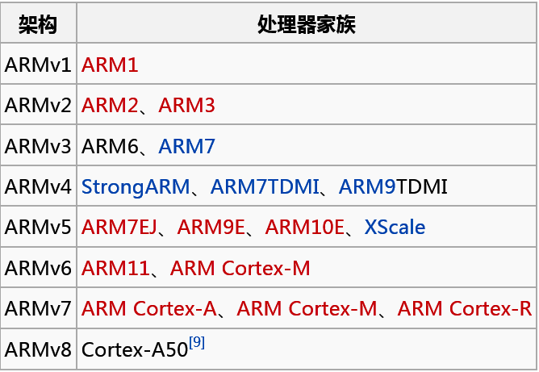
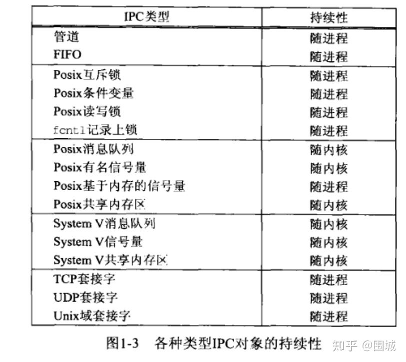
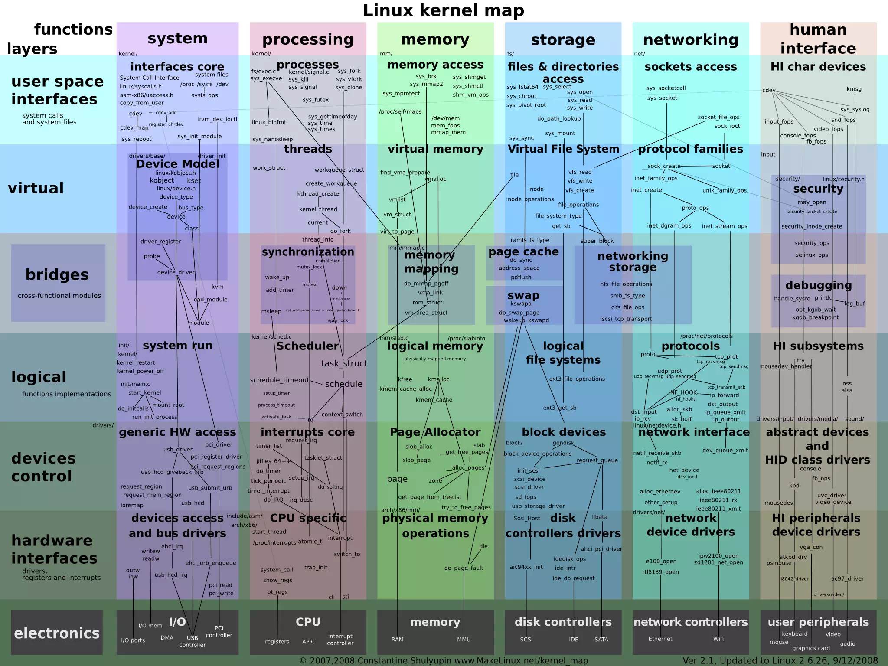

# Linux 杂项学习笔记  
## 1. 添加全局变量  
```vim
    #在profile文件中添加 arm-fsl-linux-gnueabi-gcc 
    export PATH=$PATH:/work/tool/fsl-linaro-toolchain/bin
    #使生效
    $ source /etc/profile
```
## 2. 修改apt-get下载源  
```vim
    $ vi /etc/apt/sources.list
    $ apt-get update        //将所有包的来源更新，也就是提取最新的包信息
    $ apt-get upgrade -y    //将系统中旧版本的包升级成最新的
    $ apt-get dist-upgrade -y   //
```
## 3. [安装/卸载软件方式](https://www.cnblogs.com/kinwing/p/11829546.html)  
### 安装
* 在线安装  
```vim
    // 在线<新装>安装小火车
    $ sudo apt-get install sl
    // <重装>小火车
    $ sudo apt-get install --reinstall sl
    // <更新>当前版本的包而不是安装新的版本
    $ sudo apt-get install --only-upgrade sl
```
* deb包安装  
```vim
    $ sudo dpkg -i *.deb #或直接双击安装
```
* 源码编译安装
```vim
    $ ./configure
    $ make  
    $ make install
```  

### 卸载[配置文件]
* remove只删除程序文件，保留相关的配置文件
```vim
    $ sudo apt-get remove vim
```
* purge同时删除程序文件及其配置文件
```vim
    $ sudo apt-get purge vim
    # 同上
    $ sudo apt-get remove --purge vim
```
* 删除自动安装的软件包(由于依赖而安装的)
```vim
    $ sudo apt-get autoremvoe
```
### 查看已安装软件  
* 模拟执行并输出结果  
```vim
    # 模拟执行并输出结果
    $ sudo apt-get -s install tree
    # 安装指定版本
    $ sudo apt-get install tree=1.7.0-5
```
* 查看已安装的软件  
```
    $ dpkg -l
```
### 搜索软件可安装版本
```vim
    $ sudo apt-cache search g++ | grep g++
    //使用 apt 安装的 g++ 编译器和相关库的版本只能选择大的版本号如 6 ，而无法指定具体的小版本号 6.3.0，如笔者安装的 g++-6 的版本实际为 g++-6.4.0.
    $ sudo apt install g++-n g++-n-multilib        //安装对应的 g++ 编译器和库  
```
### 总结
| apt 命令 | 取代的命令 | 命令的功能 |
| --- | --- | --- |
|apt install |apt-get install |安装软件包 |
|apt remove  |apt-get remove  |移除软件包 |
|apt purge   |apt-get purge   |移除软件包及配置文件| 
|apt update  |apt-get update  |刷新存储库索引 |
|apt upgrade |apt-get upgrade |升级所有可升级的软件包| 
|apt autoremove |apt-get autoremove |自动删除不需要的包| 
|apt full-upgrade |apt-get dist-upgrade |在升级软件包时自动处理依赖关系| 
|apt search |apt-cache search |搜索应用程序| 
|apt show   |apt-cache show   |显示装细节| 
## 4. 应用开机启动
```
    系统启动时需要加载的配置文件
    /etc/profile、/root/.bash_profile
    /etc/bashrc、/root/.bashrc
    /etc/profile.d/*.sh、/etc/profile.d/lang.sh
    /etc/sysconfig/i18n、/etc/rc.local（/etc/rc.d/rc.local）
```
* rc.local
```vim
    #!/bin/sh -e
    #
    # rc.local
    #
    # This script is executed at the end of each multiuser runlevel.
    # Make sure that the script will "exit 0" on success or any other
    # value on error.
    #
    # In order to enable or disable this script just change the execution
    # bits.
    #
    # By default this script does nothing.

    #添加开机启动 strat.sh
    /home/root/start.sh &
    exit 0
```
* /etc/profile.d/
```
    将写好的脚本（.sh文件）放到目录 /etc/profile.d/ 下，系统启动后就会自动执行该目录下的所有shell脚本
```
* chkconfig  
```

```
## 5. 网络应用协议  
* FTP  
```
    文件传输协议(File Transfer Protocol)，默认端口号21
```
```vim
    # 搭建ftp服务
    $ sudo apt-get install vsftpd
    $ sudo sevice vsftpd start      #开启ftp服务
    $ sudo netstat -a | grep ftp    #查询ftp服务 
```
* TFTP  
```
    简单文件传送协议TFTP(Trivial File Transfer Protocol)是一个TCP/IP协议族中一个很小且易于实现的文件传送协议。TFTP也是使用客户服务器方式，但它使用UDP数据报，因此TFTP需要有自己的差错改正措施
    TFTP特点：
    1.每次传送的数据PDU中有512字节的数据，但最后一次可不足512字节
    2.数据PDU也称为文件块(block)，每个块按序编号，从1开始
    3.支持ASCII码或二进制传送
    4.可对文件进行读或写
    5.使用很简单的首部
    6.TFTP只支持文件传输而不支持交互
    7.TFTP没有一个庞大的命令集
    8.没有列目录的功能
    9.也不能对用户进行身份鉴别
```
```vim
    # 搭建tftp服务
    $ sudo apt-get install tftp-hpa tftpd-hpa
    $ sudo vi /etc/default/tftpd-hpa    #修改tftp目录
    $ sudo service tftpd-hpa restart    #重启tftp服务
    $ sudo netstat -a | grep tftp       #查询tftp服务
```
> FTP和TFTP区别  
> 1. 交互使用FTP，TFTP仅允许单向传输的文件  
> 2. FTP提供身份验证，TFTP不提供身份验证  
> 3. FTP 使用已知TCP端口号[20]的数据和[21]用于连接对话框。TFTP用UDP 端口号[69]进行文件传输  
> 4. FTP依赖于TCP，是面向连接并提供可靠的控件。TFTP依赖UDP，需要减少开销, 几乎不提供控件  
* SFTP  
```
    Secure File Transfer Protocol的缩写，安全文件传送协议。可以为传输文件提供一种安全的加密方法
```
> FTP和SFTP区别  
> 1. SFTP与FTP有着几乎一样的语法和功能。SFTP为SSH的一部份，是一种传输档案至Blogger伺服器的安全方式。其实在SSH软件包中，已经包含了一个叫作SFTP(Secure File Transfer Protocol的安全文件传输子系统，SFTP本身没有单独的守护进程，它必须使用sshd守护进程（端口号默认是22）来完成相应的连接操作，所以从某种意义上来说，SFTP并不像一个服务器程序，而更像是一个客户端程序
> 2. SFTP同样是使用加密传输认证信息和传输的数据，所以，使用SFTP是非常安全的。但是，由于这种传输方式使用了加密/解密技术，所以传输效率比普通的FTP要低得多，如果您对网络安全性要求更高时，可以使用SFTP代替FTP  
* SCP
```
    scp是secure copy 的缩写, scp是linux系统下基于ssh登陆进行安全的远程文件拷贝命令
```
> SFTP和SCP区别
> 1. scp是一种基于SSH的协议，可在网络上的主机之间提供文件传输。 使用scp，您可以在主机之间快速传输文件以及基本文件属性，例如访问权限和通过FTP无法可用的时间戳。 该协议使用RCP传输文件和SSH以提供身份验证和加密
> 2. sftp是一种更强大的文件传输协议，也基于SSH。 更像是远程文件管理协议，sftp允许对远程文件（查看目录，删除文件和目录等）进行一系列操作  

> SFTP和SCP选择
> 1. 速度考虑。在传输文件时，scp通常比sftp快得多，尤其是在网络延迟很高的情况下。这是因为scp实现了更高效的传输算法，不需要等待数据包确认[选择scp]  
> 2. 安全性考虑。由于两种协议都都基于SSH，因此它们都提供相同的安全功能，包括密码和数据加密以及公钥验证。[选择scp或sftp]  
> 3. 功能/可用性考虑。scp提供的功能像其名称所暗示的那样：安全地复制文件（Secure copy）。如果您或您的用户将管理文件（包括查看/搜索目录，创建文件夹和组织文件，删除或重命名文件等），sftp是优秀的协议。此外，sftp还支持断点续传，这在网络连接不佳的环境中将大有帮助。[选择sftp]  
> 传输文件大小考虑。scp和sftp都没有文件大小限制。但是，根据文件的大小，scp的文件传输速度可能会有所帮助[选择scp]  
* SSH  
```
    远程控制通信协议(Secure Shell)，默认端口号22，SSH1使用RSA加密密钥，SSH2使用数字签名算法(DSA)密钥保护连接和认证
```
```vim
    # 搭建ssh服务
    $ sudo apt-get install openssh-client #安装ssh客户端
    $ sudo apt-get install openssh-server #安装ssh服务端
    $ sudo /etc/init.d/ssh start    # 启动ssh服务
    $ ps -ef | grep ssh #查看是否启动
    $ vi /etc/ssh/sshd_config   #查看修改配置文件
```
* Telnet  
```
    Telnet协议是TCP/IP协议族中的一员，是Internet远程登录服务的标准协议和主要方式，端口号23
```
[搭建telnet服务](https://jingyan.baidu.com/article/48b558e35e51f97f38c09ae7.html)  
> Telnet和SSH区别  
> 1. Telnet和SSH都是用于远程控制的通信协议  
> 2. SSH是加密的,需要交换密钥;而Telnet是明文的,传输的是明文字符  
* samba  
```
    samba是基于SMB协议（ServerMessage Block，信息服务块）的开源软件，samba也可以是SMB协议的商标。SMB是一种Linux、UNIX系统上可用于共享文件和打印机等资源的协议，这种协议是基于Client/Server型的协议，Client端可以通过SMB访问到Server（服务器）上的共享资源
```
* NFS  
```
    网络文件系统，英文Network File System(NFS)，是由SUN公司研制的UNIX表示层协议(presentation layer protocol)，能使使用者访问网络上别处的文件就像在使用自己的计算机一样，默认端口号：2049
```
```vim
    # 搭建nfs服务
    $ sudo apt install nfs-common           #安装客户端
    $ sudo apt install nfs-kernel-server    #安装服务端
    $ sudo vi /etc/exports                  #修改配置文件
    #添加nfs目录: /home/bhky/work/nfs-dir *(rw,sync,no_root_squash,no_subtree_check)
    #
    $ sudo /etc/init.d/rpcbind restart      #重启服务
    $ sudo /etc/init.d/nfs-kernel-server restart   

    $ mount -t nfs localhost:/home/bhky/work/nfs-dir /mnt   #挂载测试方式1
    $ mount -t nfs ip:/home/bhky/work/nfs-dir /mnt  #挂载测试方式2

```
* NTP  
```
    NTP是Network Time Protocol的缩写，又称为网络时间协议。是用来使计算机时间同步化的一种协议，它可以使计算机对其服务器或时钟源（如石英钟，GPS等等)做同步化，它可以提供高精准度的时间校正（LAN上与标准间差小于1毫秒，WAN上几十毫秒），且可介由加密确认的方式来防止恶毒的协议攻击。
    NTP默认使用的端口号是UDP123
```
```vim
    $ sudo apt-get install ntp        #安装服务端软件
    $ sudo apt-get install ntpdate    #安装客户端软件
    $ vi /etc/ntp.conf                #修改配置文件
    $ netstat -ln | grep 123          #查询是否启动方式1
    $ service ntp status              #查询是否启动方式2
    $ netdate ip    #同步时间方式1
    $ ntpdate-sync  #同步时间方式2(修改/etc/default/ntpdate)
    #时区相关
    #/etc/localtime或者查看/etc/profile中TZ
```
## 6. 设备类型 
```
　　/dev/hd[a-t]：IDE设备
　　/dev/sd[a-z]：SCSI设备
　　/dev/fd[0-7]：标准软驱
　　/dev/md[0-31]：软raid设备
　　/dev/loop[0-7]：本地回环设备
　　/dev/ram[0-15]：内存
　　/dev/null：无限数据接收设备,相当于黑洞
　　/dev/zero：无限零资源
　　/dev/tty[0-63]：虚拟终端
　　/dev/ttyS[0-3]：串口
　　/dev/lp[0-3]：并口
　　/dev/console：控制台
　　/dev/fb[0-31]：framebuffer
　　/dev/cdrom => /dev/hdc
　　/dev/modem => /dev/ttyS[0-9]
　　/dev/pilot => /dev/ttyS[0-9]
　　/dev/random：随机数设备
　　/dev/urandom：随机数设备
```
## 7. 文件颜色 
```
    白色:普通文件 
    蓝色:目录 
    绿色:可执行 
    红色:压缩文件 
    浅蓝色:链接文件
    红色闪烁:链接文件有问题
    黄色:设备文件 
    灰色:其他文件
```
## 8.文件类型
```
    七种类型
    1.普通文件类型
        Linux中最多的一种文件类型, 包括 纯文本文件(ASCII)；二进制文件(binary)；数据格式的文件(data);各种压缩文件.第一个属性为 [-]
    2.目录文件
        就是目录， 能用 # cd 命令进入的。第一个属性为 [d]，例如 [drwxrwxrwx]
    3.块设备文件
        块设备文件 ： 就是存储数据以供系统存取的接口设备，简单而言就是硬盘。例如一号硬盘的代码是 /dev/hda1等文件。第一个属性为 [b]
        字符设备
    4.字符设备文件
        即串行端口的接口设备，例如键盘、鼠标等等。第一个属性为 [c]
    5.套接字文件
        这类文件通常用在网络数据连接。可以启动一个程序来监听客户端的要求，客户端就可以通过套接字来进行数据通信。第一个属性为 [s]，最常在 /var/run目录中看到这种文件类型
    6.管道文件
        FIFO也是一种特殊的文件类型，它主要的目的是，解决多个程序同时存取一个文件所造成的错误。FIFO是first-in-first-out(先进先出)的缩写。第一个属性为 [p]
    7.链接文件
        类似Windows下面的快捷方式。第一个属性为 [l]，例如 [lrwxrwxrwx]
```
```
    -:普通文件
    d:目录文件
    l:链接文件
    b:块设备
    c:字符设备
    s:网络文件
    p:管道文件
```
## 9.文件系统自动挂载
* /etc/mtab
```
1.文件格式
    /etc/mtab 的格式和/etc/fstab 是一样的.但这个文件不能算是用户配置文件,
    他是由系统维护的.和/etc/fstab 的区别在于, fstab 是系统启动时需挂载的文
    件系统列表,而 mtab 是系统当前已挂载的文件系统列表,它由系统维护,在用户
    执行了 mount 或者 umount 命令后自动更新.用户不应该对此文件作任何修改
2.安全性
    /etc/mtab 的默认权限仍然是 644
3.相关命令
    mount
    umount
    smbmount
```
* /etc/fstab
```
1.文件格式
    /etc/fstab 记载了系统启动时自动挂载的文件系统。一行为一条记录。每条记
    录有 6 个字段，字段间用空格或者 tab 键分开。这六个字段分别是：设备名称，
    挂载点（除交换分区为 swap 外，都必须是一个存在的目录名），文件系统类型，
    mount 选项，是否需要 dump（1 表示需要，0 表示不需要），在 reboot 期间 fsck
    检查的顺序（激活文件系统设定为 1，其余文件系统设定为 2，若设定为 0 表示
    该文件系统不需要被检查）。
    在 linux 和 windows 共存时，也许想开机自动挂载 windows 分区，那么就可以
    在这个文件里加上相应的记录。
    某些时候对硬盘分区作了调整以后，这里也需要做一些相应的修改。否则会出
    现一些问题。
    可用的 mount 选项：
    async
        对该文件系统的所有 I/O 操作都异步执行
    ro
        该文件系统是只读的
    rw
        该文件系统是可读可写的
    atime
        更新每次存取 inode 的存取时间
    auto
        可以使用 -a 选项 mount
    defaults
        使用预设的选项：rw,suid,dev,exec,auto,nouser,async
    dev
        解释在文件系统上的字符或区块设备
    exec
        允许执行二进制文件
    noatime
        不要在这个文件系统上更新存取时间
    noauto
        这个文件系统不能使用 -a 选项来 mount
    nodev
        不要解释在文件系统上的字符或区块设备
    noexec
        不允许在 mounted 文件系统上执行任何的二进制文件。这个选项对于具有包含
        非它自己的二进制结构的文件系统服务器而言非常有用
    nosuid
        不允许 setuid 和 setgid 位发生作用。（这似乎很安全，但是在安装 suidperl
        后，同样不安全）。
    nouser
        限制一般非 root 用户 mount 文件系统
    remount
        尝试重新 mount 已经 mounted 的文件系统。这通常是用来改变文件系统的 mount
        标志，特别是让只读的文件系统变成可擦写的
    suid
        允许 setuid 和 setgid 位发生作用
    sync
        文件系统的所有 I/O 同步执行
    user
        允许一般非 root 用户 mount 文件系统。这个选项会应用 noexec,nosuid,nodev
        这三个选项（除非在命令行上有指定覆盖这些设定的选项）。
2.安全性
    /etc/fstab 的默认权限是 644,所有者和所有组均为 root
3.相关命令
    mount
    df
    列举计算机当前“可以安装”的文件系统。这非常重要，因为计算机引导时将
    运行 mount -a 命令，该命令负责安装 fstab 的倒数第二列中带有“1”标记
    的每一个文件系统。
```
* /etc/mtools.conf 
```
    DOS 类型的文件系统上所有操作（创建目录、复制、格式化等等）的配置
```
## 10.热插拔
* [udev实现热插拔](https://www.cnblogs.com/linhaostudy/archive/2017/11/12/7820518.html)
>```
> usb（网卡、u盘等）和sd卡
>```
* [udev、mdev和devfs之间的区别](https://blog.csdn.net/wade_510/article/details/72083189)
```
    mdev是udev的简化版本，是busybox中所带的程序，最适合用在嵌入式系统，而udev一般用在PC上的linux中，相对mdev来说要复杂些。
    devfs是2.4内核引入的，而在2.6内核中却被udev所替代，他们有着共同的优点，只是devfs中存在一些未修复的BUG，作者也停止了对他的维护，最显著的一个区别，采用devfs时，当一个并不存在的设备结点时，他却还能自动的加载对应的设备驱动，而udev则不能加载，因为加载浪费了资源。

    dev和mdev是两个使用uevent 机制处理热插拔问题的用户空间程序，两者的实现机理不同。
    udev是基于netlink 机制的，它在系统启动时运行了一个deamon程序udevd，通过监听内核发送的uevent来执行相应的热拔插动作，包括创建/删除设备节点，加载/卸载驱动模块等等。
    mdev是基于uevent_helper机制的，它在系统启动时修改了内核中的uevnet_helper变量（通过写/proc/sys/kernel/hotplug），值为“/sbin/mdev”。这样内核产生uevent时会调用uevent_helper所指的用户级程序，也就是mdev，来执行相应的热拔插动作。udev使用的netlink机制在有大量uevent的场合效率高，适合用在PC 机上。

```
> 思考：热插拔(udev)和文件系统自动挂载(fstab)之间的关系
## 11.[update-alternatives](https://www.jianshu.com/p/4d27fa2dce86)
```
    1.alternatives 的管理目录 /etc/alternatives
    2.查看软件候选项
        $ update-alternatives --display arm-linux-gnueabi-gcc
    3.选择软件候选项
        $ update-alternatives --config arm-linux-gnueabi-gcc
    4.添加一个命令的link值
        $ update-alternatives --install /usr/bin/python python /usr/bin/python2.7 2
    5.删除一个命令的link值
        $ update-alternatives –remove python /usr/bin/python2.7
```
* 语法
```
$ update-alternatives --help
用法：update-alternatives [<选项> ...] <命令>

命令：
  --install <链接> <名称> <路径> <优先级>
    [--slave <链接> <名称> <路径>] ...
                           在系统中加入一组候选项。
  --remove <名称> <路径>   从 <名称> 替换组中去除 <路径> 项。
  --remove-all <名称>      从替换系统中删除 <名称> 替换组。
  --auto <名称>            将 <名称> 的主链接切换到自动模式。
  --display <名称>         显示关于 <名称> 替换组的信息。
  --query <名称>           机器可读版的 --display <名称>.
  --list <名称>            列出 <名称> 替换组中所有的可用候选项。
  --get-selections         列出主要候选项名称以及它们的状态。
  --set-selections         从标准输入中读入候选项的状态。
  --config <名称>          列出 <名称> 替换组中的可选项，并就使用其中哪一个，征询用户的意见。
  --set <名称> <路径>      将 <路径> 设置为 <名称> 的候选项。
  --all                    对所有可选项一一调用 --config 命令。

<链接> 是指向 /etc/alternatives/<名称> 的符号链接。(如 /usr/bin/pager)
<名称> 是该链接替换组的主控名。(如 pager)
<路径> 是候选项目标文件的位置。(如 /usr/bin/less)
<优先级> 是一个整数，在自动模式下，这个数字越高的选项，其优先级也就越高。
```
## 12.运行级别
```
    0： 系统停机（关机）模式，系统默认运行级别不能设置为0，否则不能正常启动，一开机就自动关机。
    1：单用户模式，root权限，用于系统维护，禁止远程登陆，就像Windows下的安全模式登录。
    2：多用户模式，没有NFS网络支持。
    3：完整的多用户文本模式，有NFS，登陆后进入控制台命令行模式。
    4：系统未使用，保留一般不用，在一些特殊情况下可以用它来做一些事情。例如在笔记本电脑的电池用尽时，可以切换到这个模式来做一些设置。
    5：图形化模式，登陆后进入图形GUI模式或GNOME、KDE图形化界面，如X Window系统。
    6：重启模式，默认运行级别不能设为6，否则不能正常启动，就会一直开机重启开机重启
```
## 13.man
```
    1是普通的命令
    2是系统调用,如open,write之类的(通过这个，至少可以很方便的查到调用这个函数，需要加什么头文件)
    3是库函数,如printf,fread
    4是特殊文件,也就是/dev下的各种设备文件
    5是指文件的格式,比如passwd,就会说明这个文件中各个字段的含义
    6是给游戏留的,由各个游戏自己定义
    7是附件还有一些变量,比如向environ这种全局变量在这里就有说明
    8是系统管理用的命令,这些命令只能由root使用,如ifconfig
```
```
    简要说明
    NAME:名字和简短介绍
    SYNOPSIS:命令下达语法
    DESCRIPTION:描述
    EXAMPLES:例子
    SEE ALSO:更多可使用的
```
## 14.kill
```vim
    $ killall -g 进程名 #杀掉同一组的进程
```
## 15.时间格式
```
GMT:格林威治标准时间
UTC:世界协调时间
DST:夏日节约时间
CST:代表４个不同时区：
    UT-6:00（美国）
    UT+9:30（澳大利亚）
    UT+8:00（中国）
    UT-4:00 （古巴）
```
## 16.快速查看宏定义
```
    建一个test.c,把需要查看的宏用上，然后gcc -E test.c > test.info,打开test.info查看即可
```
## 17.配置arm为nfs启动
```
    arm上进行nfs配置(可在boot时直接挂在根文件系统,也可以进入系统后挂载)
    1.首先验证可以手动挂载,确保挂载正确
    2.修改menuconfig
        a.启动网络文件系统功能
        b.开启nfs功能(boot)
        c.网络配置(Networking support->Networking options->IP支持)
    3.nfs挂载(uboot配置)
        printenv    #查看环境变量，按如下配置
        baudrate=115200
        boot=$LOAD && $LOAD $fdtaddr $fdtfile && setenv bootargs $mtdparts $params root=/dev/$BOOTARGS && bootm $loadaddr - $fdtaddr
        boot_emmc=LOAD='ext2load mmc 0:1'; BOOTARGS='mmcblk0p1 ro'; run boot
        《boot_net=LOAD=tftp; BOOTARGS="nfs rw ip=192.168.1.60:192.168.1.221:192.168.1.1:255.255.255.0::eth0:off nfsroot=$serverip:$rootpath,nolock"; run boot》
        boot_rom=LOAD=fsload; BOOTARGS='mtdblock1 ro rootfstype=cramfs,jffs2'; run boot
        boot_sata=dcache off; sata init; LOAD='ext2load sata 0:1'; BOOTARGS='sda1 ro'; run boot
        boot_sd=LOAD='ext2load mmc 1:1'; BOOTARGS='mmcblk1p1 ro'; run boot
        boot_sdmmc=LOAD='ext2load mmc 2:1'; BOOTARGS='mmcblk3p1 ro'; run boot
        boot_usb=usb start; LOAD='ext2load usb 0:1'; BOOTARGS='sda1 ro'; run boot
        bootcmd=run boot_net
        bootdelay=1
        bootfile=/boot/uImage
        ethact=FEC
        ethaddr=00:30:64:14:bf:a2
        ethprime=FEC
        fdt_high=0xffffffff
        fdtaddr=0x18000000
        fdtfile=/boot/lec-imx6q.dtb
        initrd_high=0xffffffff
        《ipaddr=192.168.1.60》
        loadaddr=0x12000000
        mtdparts=mtdparts=spi32765.0:384K(u-boot)ro,-(root)
        《netmask=255.255.255.0》
        params=rootwait console=ttymxc0,115200
        《rootpath=/home/bhky/work/nfs-dir》
        《serverip=192.168.1.221》
        stderr=serial
        stdin=serial
        stdout=serial
```
## 18.i2ctools
```
    # i2cdump、i2cget、i2cset和i2cdetect使用
```
## 19.canutils
```
    # cansend和candump使用
```
## 20.内核添加驱动源码和驱动配置
```
    1.在drivers下面新建一个文件夹 mkdir gpiotest
    2.将驱动源码添加进gpiotest
    3.新建Kconfig和Makfile文件
        Kconfig格式仿照其他Kconfig写
        Makfile格式仿照其他Makfile写
    4.将gpiotest添加进drivers下面的Kconfig
        source "drivers/gpiotest/Kconfig"
    5.将gpiotest添加进drivers下面的Makefile
        obj-$(CONFIG_GPIOTEST)	+= gpiotest/
        通过menuconfig就可以在Device Drivers最后看到 新添加的gpio选项
```
## 21.手动加载/移除模块
```vim
    #方式1
    insmod drv.ko   #安装模块
    rmmod drv.ko    #移除模块
    #方式2
    modprobe drv    #安装模块，模块是放在/lib/modules/`uname -r`/, 然后需要先depmod
    rmmod drv       #移除模块
```
## 22.虚拟文件系统
* /proc/kallsyms
```
    CONFIG_KALLSYMS=y 符号表中包含的所有函数
    CONFIG_KALLSYMS_ALL=y 符号表中包含的所有变量（包括没有用到EXPORT_SYSBOL导出的变量）
    CONFIG_KALLSYMS_EXTRA_PASS=y
```
## 23.运算符优先级
```
    先指针，单双目
    先算术，后移位
    比大小，判相等
    位操作，逻辑跟
    多赋值，逗号底
    单多赋，右到左
```
## 24.inetl网卡(i210)移植
```
	1.lspci 查看是否有pci id为8086:153x
	2.通过EEUPDATE更新i210配置(invm和flash两种),工具在intel官网下载
	3.内核中添加对应的驱动
```
## 25.[交叉编译工具链](https://blog.csdn.net/guodeqiangde/article/details/78239408)
* **当前使用版本**
```
    gcc:
        系统版本：Ubuntu 14.04.6 LTS
        gcc版本：gcc (Ubuntu 4.8.4-2ubuntu1~14.04.4) 4.8.4
    arm-linux-gcc->arm-linux-gnueabihf-gcc[adlink]:
        系统版本：Ubuntu 14.04.6 LTS
        arm-linux-gcc版本: gcc version 4.9.1 20140710 (prerelease) (crosstool-NG linaro-1.13.1-4.9-2014.07 - Linaro GCC 4.9-2014.07)
        文件：gcc-linaro-arm-linux-gnueabihf-4.9-2014.07_linux
        编译内核：4.1.15-1.0.0
    arm-poky-linux-gnueabi-gcc[advantech]:
        系统版本：Ubuntu 14.04.6 LTS
        arm-poky-linux-gnueabi-gcc版本：gcc version 5.3.0 (GCC)
        文件：fsl-imx-x11-2.1.tar.bz2
        编译内核：4.1.15-2.0.0
    arm-linux-gcc->arm-fsl-linux-gnueabi-gcc[norco]:
        系统版本：Ubuntu 14.04.6 LTS
        arm-fsl-linux-gnueabi-gcc版本：gcc version 4.6.2 20110630 (prerelease) (Freescale MAD -- Linaro 2011.07 -- Built at 2011/08/10 09:20)
        文件：fsl-linaro-toolchain
        编译内核：未开放
```
* **命名规则**
```
交叉编译工具链的命名规则为：arch [-vendor] [-os] [-(gnu)eabi]
* arch – 体系架构，如ARM，MIPS
* vendor – 工具链提供商
* os – 目标操作系统
* eabi – 嵌入式应用二进制接口（Embedded Application Binary Interface）

根据对操作系统的支持与否，ARM GCC可分为支持和不支持操作系统，如
* arm-none-eabi：这个是没有操作系统的，自然不可能支持那些跟操作系统关系密切的函数，比如fork(2)。他使用的是newlib这个专用于嵌入式系统的C库。
* arm-none-linux-eabi：用于Linux的，使用Glibc
```
* **各版本arm-gcc区别**

```
armcc
    ARM 公司推出的编译工具，功能和 arm-none-eabi 类似，可以编译裸机程序（u-boot、kernel），但是不能编译 Linux 应用程序。armcc一般和ARM开发工具一起，Keil MDK、ADS、RVDS和DS-5中的编译器都是armcc，所以 armcc 编译器都是收费的

arm-eabi-gcc
    Android ARM 编译器

arm-none-eabi-gcc
    （ARM architecture，no vendor，not target an operating system，complies with the ARM EABI）
    用于编译 ARM 架构的裸机系统（包括 ARM Linux 的 boot、kernel，不适用编译 Linux 应用 Application），一般适合 ARM7、Cortex-M 和 Cortex-R 内核的芯片使用，所以不支持那些跟操作系统关系密切的函数，比如fork(2)，他使用的是 newlib 这个专用于嵌入式系统的C库

arm-none-linux-gnueabi-gcc
    1.arm-none-linux-gnueabi-gcc是 Codesourcery 公司（目前已经被Mentor收购）基于GCC推出的的ARM交叉编译工具。可用于交叉编译ARM系统中所有环节的代码，包括裸机程序、u-boot、Linux kernel、filesystem和App应用程序
    (ARM architecture, no vendor, creates binaries that run on the Linux operating system, and uses the GNU EABI)

    2.主要用于基于ARM架构的Linux系统，可用于编译 ARM 架构的 u-boot、Linux内核、linux应用等。arm-none-linux-gnueabi基于GCC，使用Glibc库，经过 Codesourcery 公司优化过推出的编译器。arm-none-linux-gnueabi-xxx 交叉编译工具的浮点运算非常优秀。一般ARM9、ARM11、Cortex-A 内核，带有 Linux 操作系统的会用到

arm-none-uclinuxeabi-gcc 和 arm-none-symbianelf-gcc
    arm-none-uclinuxeabi 用于uCLinux，使用Glibc
    arm-none-symbianelf 用于symbian

```
* **ABI和EABI**
```
ABI：二进制应用程序接口(Application Binary Interface (ABI) for the ARM Architecture)。在计算机中，应用二进制接口描述了应用程序（或者其他类型）和操作系统之间或其他应用程序的低级接口。

EABI：嵌入式ABI。嵌入式应用二进制接口指定了文件格式、数据类型、寄存器使用、堆积组织优化和在一个嵌入式软件中的参数的标准约定。开发者使用自己的汇编语言也可以使用 EABI 作为与兼容的编译器生成的汇编语言的接口。

两者主要区别是，ABI是计算机上的，EABI是嵌入式平台上（如ARM，MIPS等)
```
* **arm-linux-gnueabi-gcc 和 arm-linux-gnueabihf-gcc**
```
两个交叉编译器分别适用于 armel 和 armhf 两个不同的架构，armel 和 armhf 这两种架构在对待浮点运算采取了不同的策略（有 fpu 的 arm 才能支持这两种浮点运算策略）。
arm-linux-gnueabi-gcc: 使用hard硬件浮点模式
arm-linux-gnueabi-gcc：使用softfp模式

其实这两个交叉编译器只不过是 gcc 的选项 -mfloat-abi 的默认值不同。gcc 的选项 -mfloat-abi 有三种值 soft、softfp、hard（其中后两者都要求 arm 里有 fpu 浮点运算单元，soft 与后两者是兼容的，但 softfp 和 hard 两种模式互不兼容）：
soft： 不用fpu进行浮点计算，即使有fpu浮点运算单元也不用，而是使用软件模式。
softfp： armel架构（对应的编译器为 arm-linux-gnueabi-gcc ）采用的默认值，用fpu计算，但是传参数用普通寄存器传，这样中断的时候，只需要保存普通寄存器，中断负荷小，但是参数需要转换成浮点的再计算。
hard： armhf架构（对应的编译器 arm-linux-gnueabihf-gcc ）采用的默认值，用fpu计算，传参数也用fpu中的浮点寄存器传，省去了转换，性能最好，但是中断负荷高。
```
* **安装方式**
```
1.Linux解压版：在Linux主机（如Ubuntu、RedHat等）直接解压即可使用。推荐方式！
2.Linux安装版：在Linux主机下执行后按照提示安装后使用。
3.Windows解压版：在Windows系统下解压后使用，但是需要MingW32。
4.Windows安装版：在Windows系统下安装后使用。
5.RPM安装版：RedHat系统安装包，新版本不提供该类安装包。
6.源码版：交叉编译器源代码，一般很少用到
```
* **安装/卸载**
```vim
    //安装arm-linux-gnueabi-gcc或arm-linux-gnueabidf-gcc
    $ sudo apt-get install gcc-arm-linux-gnueabi 
    $ sudo apt-get install gcc-arm-linux-gnueabihf
    //安装arm-linux-gnueabi-g++或arm-linux-gnueabidf-g++
    $ sudo apt-get install g++-arm-linux-gnueabi
    $ sudo apt-get install g++-arm-linux-gnueabihf

    //卸载arm-linux-gnueabi-gcc或arm-linux-gnueabidf-gcc
    $ sudo apt-get remove --purge gcc-arm-linux-gnueabi 
    $ sudo apt-get remove --purge gcc-arm-linux-gnueabihf  
    //卸载arm-linux-gnueabi-g++或arm-linux-gnueabidf-g++
    $ sudo apt-get remove --purge g++-arm-linux-gnueabi
    $ sudo apt-get remove --purge g++-arm-linux-gnueabihf  

注：
    这样安装一般是当前系统支持的最新版本，当然可以根据实际版本需求，进行压缩包解压安装，添加到系统路径即可
```
* **下载地址**
> * [GCC Releases](https://gcc.gnu.org/releases.html)
> * [linaro](https://www.linaro.org)
> * [arm](https://developer.arm.com/tools-and-software/open-source-software/developer-tools/gnu-toolchain/gnu-rm/downloads)
## 26.ip设置
```
    静态ip
    dhcp
    注：在连接到支持dhcp的路由上时，怎么使用
```
## 27.[stty](https://baike.baidu.com/item/stty)
```
    打印或更改terminal(终端)的设置
```
## 28.485转向
```
    有三种方式实现收发转向
    1.DCE模式
        TX  <---> RO (485转换芯片PIN1)
        RX  <---> DI (485转换芯片PIN4)
        RTS <---> RE/DE (485转换芯片PIN2和PIN3,PIN2和PIN3短接)
        RTS作为普通IO,手动输出高低实现收发转向控制(应用层控制GPIO)
    2.DCE模式(imx6只有在DCE时可以,手册上有说明)
        TX  <---> RO (485转换芯片PIN1)
        RX  <---> DI (485转换芯片PIN4)
        CTS <---> RE/DE (485转换芯片PIN2和PIN3,PIN2和PIN3短接)
        采用硬件流控,驱动层实现自动转向
    3.DTE模式
        RX  <---> RO (485转换芯片PIN1)
        TX  <---> DI (485转换芯片PIN4)
        RTS <---> RE/DE (485转换芯片PIN2和PIN3,PIN2和PIN3短接)
        采用硬件流控,驱动层实现自动转向
```
## 29.文件系统
```
    在嵌入式linux应用中，主要的存储设备为RAM和FLASH。常用的基于存储设备的文件系统类型包括：jffs2，yaffs，cramfs，ramdisk，ramfs等。
    1.jffs2：日志闪存文件系统版本2，用于NOR flash，可读写、支持数据压缩的日志文件系统
    2.yaffs/ubitFS：用于nand flash设计的一种日志型文件系统，不支持数据压缩
    3.Cramfs:只读的压缩文件系统（用的越来越少）
    4.Ramdisk：将部分固定大小的内存当做块设备来使用
    5.Initramfs：将内存当做块设备用（现在用的多）
    6.NFS：网络文件系统 (开发阶段使用)
```
## 30.常见压缩
  
## 31.TCP流程
  
## 32.UDP流程  
  
## 33.Visual Studio 2013
* 使用
```
    1.文件->项目->Vistual C++->空项目
    2.添加头文件
        项目右键->属性->配置属性->C/C++->常规->附加包含目录
    3.添加lib库
        项目右键->属性->配置属性->链接器->常规->附加包含目录
    4.添加源/头文件
        源文件右键->添加->新建项->cpp/h文件
    5.boost库
        boost_1_55_0-msvc-12.0-64.exe
```
## 34.嵌入式框架(总结)
  
* [学习linux应用编程](https://blog.csdn.net/yychuyu/article/details/80636496)
```vim
对于Linux应用的学习，主要有六部分：1. 环境搭建；2. 基本操作；3. 系统编程；4. 网络编程；5. 数据库编程，6. Shell编程。下面一一详细介绍。
1. 环境搭建
作为Linux工程师，毋庸置疑一定需要Linux环境。对于Linux环境的获取，我们通常有两种方式：
* 将电脑整体安装为Linux系统；
* 在电脑里安装一个虚拟机，跑Linux电脑；
* Window+Linux双系统。
得到Linux环境后还不够，还要知道如何配置、如何远程连接Linux电脑、如何与Linux电脑互传文件、如何在主机上阅读Linux电脑中的代码，等等。

2. 基本操作
众所周知，Linux很少或几乎没有界面，所有的操作几乎都可以通过命令行来完成。对于运维人员来说，需要掌握相当大量的Linux命令。而对于应用、驱动方向的人员来说，只需掌握一些基本的常用的命令即可。对于这部分很多人建议看 「鸟哥的私房菜」 ，但我觉得这个更适合运维人员，我们无需掌握那么多命令。

3. 系统编程
在学系统编程之前，一定要先学习Makefile，这会为后续的学习提高很大效率。之后的系统编程，主要有几大块：IO编程、进程、线程、进程间通讯（包括管道、信号、信号量、共享内存等）。这几部分学完了，基本也就差不多了。

4. 网络编程
网络编程主要就是socket，poll，epoll，以及对TCP/IP的理解，同时要学会高并发式服务器的编写。进程池，线程池的理解。

5. 数据库编程
数据库的内容其实并不属于Linux，但在项目中经常要用到。这部分主要要学会数据库的基本操作，以及如何写一套接口去操作数据库。

6. Shell编程
Shell是Linux下的脚本语言，功能虽然不如高级语言强大，但它可能做很多事，在某些场合甚至比高级语言要方便得多。当然除了Shell脚本，还有Python脚本。

Linux应用编程书籍推荐：
* UNIX环境高级编程。简称APUE，号称程序员的圣经。它不是一本API字典，它还讲述了很多操作系统的细节，内存，文件系统等方面，是一本难得的好书。但是它起点有点高，不适合初学者。
* Linux程序设计。如果觉得APUE有点难入门的话，可以选择此书进行入门。
* Unix/Linux系统编程手册。这本书号称是一本超越APUE的书，它是一本比较新的书，里面新增了APUE所没有的Linux/Unix新特性。而且对于一些概念性的东西讲的确实比APUE好。但至于能否超载APUE，还有待历史的考验。
* UNIX 网络编程。也是一本非常经典的书，主要是网络编程方向的。简称UNP
* MySQL必知必会。本书在Amazon上长期排在数据库销售榜首，建议想快速了解数据库原理和MySQL的新手阅读。快餐性质，简洁明快，小开本，而且很薄，比较好阅读。
* Linux Shell脚本攻略。这本书很薄很精华，它追求的不是全，而是精，所以用它来入门再适合不过了。

学完以上六部分，基本就有能力完成Linux环境下的应用编程了。当然，在有些场合我们可能还需要用到Python脚本。像我公司的项目部分脚本就是用Python完成的。对于Python的入门，可以参考 「简明Python教程」。但如果想进一步提高的话，那就需要阅读大量书籍了。对于Linux层级的脚本应用，掌握一些基础的足够了。
```
* [学习linux内核](https://blog.csdn.net/xzjj2007/article/details/48438311)
```
* 了解操作系统基本概念  
    如果不会，可以学习《操作系统：设计与实现》Andrew S.Tanenbaum 写的那本。以MINIX为例子讲解操作系统的概念。非常推荐。
* 了解Linux内核机制  
    有了操作系统的基本概念以后，可以了解Linux的机制了。推荐《Linux内核设计与实现》Robert Love 写的。这本书从概念上讲解了Linux有什么，他们是怎么运行的。这本书要反复认真看透。
* 研究Linux内核源码  
    有了Linux内核的了解，还需要具体研究Linux内核源码。最经典的就是《深入理解Linux内核》Daniel P. Bovet 写的。学习这本书的时候，要对着内核代码看着学。这本书学起来相当费力了，那么多多代码要研究。不过这本书如果学明白了，恭喜你，Linux内核你已经很熟悉了。
* 设备驱动方向学习 
    如果要开发设备驱动，可以学习《linux设备驱动程序》O’Reilly出版社的。这本作为驱动的入门是很好的资料。另外还有一本《精通 Linux 驱动程序开发》也是不错的教材，可以参考着看。学习驱动，免不了要学习一些硬件的协议和资料，研究哪个就找到相应的硬件文档，把硬件的工作原 理搞明白。这些就不细说了。
* 网络方向学习  
    网络部分，学些Linux网络部分就学习《深入理解LINUX网络技术内幕》。这本书把Linux的网络部分讲的非常清晰透彻。但是通常不做这方面的工作研究，也不用研究这么深，毕竟现在国内相关职位较少。
* 嵌入式开发 
    现在Linux相关的工作，多集中在一些嵌入式开发领域，arm，mips等，要学习以下这些体系架构的的资料，了解CPU的设计和工作方式。 ARM就看对应的芯片手册，讲的很细致。MIPS就看 《see mips run》，有一二两版，两版内容有些差异，推荐都看。
* 补充一点经验 
    不要认为Linux很庞大，很复杂，就觉的很难学。任何东西认真学下来都是能学会的，看你的恒心和毅力了。另外，不要走弯路，不要看 市面上讲什么Linux0.11的那些书，直接学你要学的东西。就像学C语言看什么谭浩强一样，弯路走了，力气没少花，还严重影响学习效果。
你问的内核，多给你说几句应用编程，有时候经常会需要的： 
    1. 学习Linux应用编程，建议看《unix环境高级编程》，把里面的例子都做一遍，会对整个Linux编程有系统都认识。 
    2. 针对Linux，有本 《Linux系统编程》，学完上一本，这本很快看一遍就懂了。主要是针对Linux具体懂一些内容，讲的挺全了，很实用。 
    3. Linux网络编程，系统的学习一下《unix网络编程.卷1,套接字联网api》，基本上网络应用相关的程序就都没问题了。
```
* [linux学习之路](https://blog.csdn.net/Rock_Ling/article/details/79569995)
* 嵌入式从入门到实战项目完整课程
```
    01 - Linux C语言
    02 - Linux C语言_高级
    03 - 数据结构全攻略
    04 - 嵌入式Linux下文件IO精讲
    05 - Linux并发程序设计你该这么学
    06 - Linux网络编程必修篇
    07 - 嵌入式数据库之Sqlite3
    08 - 在线词典综合实战
    09 - 精通ARM体系结构及接口技术
    10 - 全面掌握嵌入式系统移植 
    11 - 嵌入式内核及驱动开发（初级）
    12 - 嵌入式内核及驱动开发（高级）
    13 - 嵌入式项目实战
    14 - 精通STM32开发
    15 - ZigBee系统开发
    16 - 蓝牙4.0 BLE
    17 - RFID开发与应用
    18 - LoRa开发与应用
    19 - NB-IOT技术实践开发
    20 - WIFI开发与应用
```
## 35.[cgi](https://github.com/boutell/cgic.git)
  
## 36.字节对齐
* [字节对齐背景知识](https://www.cnblogs.com/clover-toeic/p/3853132.html)
```vim
    字节对齐的问题主要就是针对结构体
```
* 对齐准则说法1  
```
    1.数据类型自身的对齐值：char型数据自身对齐值为1字节，short型数据为2字节，int/float型为4字节，double型为8字节。
    2.结构体或类的自身对齐值：其成员中自身对齐值最大的那个值。
    3.指定对齐值：#pragma pack (value)时的指定对齐值value。
    4.数据成员、结构体和类的有效对齐值：自身对齐值和指定对齐值中较小者，即有效对齐值=min{自身对齐值，当前指定的pack值}。
```
* 对齐准则说法2
```
    1.结构体变量的首地址能够被其最宽基本类型成员的大小所整除；
    2.结构体每个成员相对结构体首地址的偏移量(offset)都是成员大小的整数倍，如有需要编译器会在成员之间加上填充字节(internal adding)；
    3.结构体的总大小为结构体最宽基本类型成员大小的整数倍，如有需要编译器会在最末一个成员之后加上填充字节{trailing padding}。
```
* 字节对齐方式
> * 方式1  
> 使用伪指令#pragma pack(n)：C编译器将按照n个字节对齐；  
> 使用伪指令#pragma pack()： 取消自定义字节对齐方式。
```vim
    //按2字节对齐
    #pragma pack(2)  //指定按2字节对齐
    struct C{
        char  b;
        int   a;
        short c;
    };
    #pragma pack()   //取消指定对齐，恢复缺省对齐
```
```vim
    //按8字节对齐
    #pragma pack(8)
    struct D{
        char  b;
        short a;
        char  c;
    };
    #pragma pack()
    //虽然#pragma pack(8)，但依然按照两字节对齐，所以sizeof(struct D)的值为6。因为：对齐到的字节数 = min｛当前指定的pack值，最大成员大小｝
```
> * 方式2(GCC特有语法)  
> \_\_attribute__((aligned (n)))：让所作用的结构成员对齐在n字节自然边界上。如果结构体中有成员的长度大于n，则按照最大成员的长度来对齐  
> \_\_attribute__ ((packed))：取消结构在编译过程中的优化对齐，按照实际占用字节数进行对齐
```vim
    //按1字节对齐(GCC)
    #define GNUC_PACKED __attribute__((packed))
    struct C{
        char  b;
        int   a;
        short c;
    }GNUC_PACKED;
```
## 37.STM32-lwip
```
初始化流程
1.分配内存
	ETH_Mem_Malloc
	lwip_comm_mem_malloc
	lwip_comm_default_ip_set（获取默认ip、netmask、gatway）
2.设置mac
	读st芯片唯一id作为mac地址
	硬复位lan8720
	初始化ETH（配置mac和开启中断）
		HAL_ETH_Init
3.初始化lwip
	lwip_init
	转换ip、netmask和gateway
		IP4_ADDR
	网卡名称
	netif_add
		添加网卡
		初始化ip、netmask和gateway及硬件初始化
	netif_set_default
		设定默认网卡
	netif_set_up
		启动网卡

注意事项
	1.没有插网线时上电
	2.连续连接断开（看stm32的tcp收发是否正常）
	3.正常连接，拔网线->插网线
		无心跳时，插拔可正常通信
		心跳（3秒一次，一次poll是0.5秒）
```
## 38.查看/修改系统主频
```
1.cat /proc/cpuinfo
2.cat /sys/devices/system/cpu/cpu0/cpufreq/cpu_cur_freq
   //手动修改主频
   echo userspace > 	//开启用户权限
   echo 792000 > 		//设置主频
```
## 39.存储
```
     emmc
     ssd
     sdio 
     eeprom 
     ufs 
     ddr
```
## 40.ps使用
```
    # 查看某个进程创建的线程
    $ ps -T -p <pid>
```
## 41.websocket
* [RFC 6455 - The WebSocket Protocol](https://blog.csdn.net/u011645307/article/details/76682705)
## 42.ARM体系架构
* [ARM CPU 架构](https://www.cnblogs.com/zhangjiankun/p/4852749.html)

* [ARM体系架构总结](https://blog.csdn.net/frank_zyp/article/details/84646051)
* [ARM架构处理器全解析](https://blog.csdn.net/FunkyFrog821951259/article/details/79896210)
## 43.进程间通信持续性
* [IPC持续性](https://zhuanlan.zhihu.com/p/37872762)
* [进程间通信](http://www.cppblog.com/tankzhouqiang/archive/2011/07/04/150085.html)

## 44.linux kernel map

## 45.[环境变量](https://www.freecplus.net/ebfb46a0f8014f59a16c78ec8de73468.html)
* 环境变量含义
```
    程序（操作系统命令和应用程序）的执行都需要运行环境，这个环境是由多个环境变量组成的。
```
* 环境变量的分类
```
1）按生效的范围分类。
系统环境变量：公共的，对全部的用户都生效。
用户环境变量：用户私有的、自定义的个性化设置，只对该用户生效。

2）按生存周期分类。
永久环境变量：在环境变量脚本文件中配置，用户每次登录时会自动执行这些脚本，相当于永久生效。
临时环境变量：使用时在Shell中临时定义，退出Shell后失效。
```
* 常用环境变量
```
1）PATH
可执行程序的搜索目录，可执行程序包括Linux系统命令和用户的应用程序，PATH变量的具体用法本文后面的章节中有详细的介绍。
2）LANG
Linux系统的语言、地区、字符集，LANG变量的具体用法本文后面的章节中有详细的介绍。
3）HOSTNAME
服务器的主机名。
4）SHELL
用户当前使用的Shell解析器。
5）HISTSIZE
保存历史命令的数目。
6）USER
当前登录用户的用户名。
7）HOME
当前登录用户的主目录。
8）PWD
当前工作目录。
9）LD_LIBRARY_PATH
C/C++语言动态链接库文件搜索的目录，它不是Linux缺省的环境变量，但对C/C++程序员来说非常重要，具体用法本文后面的章节中有详细的介绍。
```
* 系统环境变量
```
系统环境变量对全部的用户生效，设置系统环境变量有三种方法。
1）在/etc/profile文件中设置。
用户登录时执行/etc/profile文件中设置系统的环境变量。但是，Linux不建议在/etc/profile文件中设置系统环境变量。
2）在/etc/profile.d目录中增加环境变量脚本文件，这是Linux推荐的方法。
/etc/profile在每次启动时会执行 /etc/profile.d下全部的脚本文件。/etc/profile.d比/etc/profile好维护，不想要什么变量直接删除 /etc/profile.d下对应的 shell 脚本即可。
3）在/etc/bashrc文件中设置环境变量。
该文件配置的环境变量将会影响全部用户使用的bash shell。但是，Linux也不建议在/etc/bashrc文件中设置系统环境变量。
```
* 用户环境变量
```
用户环境变量只对当前用户生效，设置用户环境变量也有多种方法
1）.bash_profile（推荐首选）
当用户登录时执行，每个用户都可以使用该文件来配置专属于自己的环境变量。
2）.bashrc
当用户登录时以及每次打开新的Shell时该文件都将被读取，不推荐在里面配置用户专用的环境变量，因为每开一个Shell，该文件都会被读取一次，效率肯定受影响
3）.bash_logout
当每次退出系统（退出bash shell）时执行该文件
4）.bash_history
保存了当前用户使用过的历史命令
```
* 环境变量脚本文件的执行顺序
```
/etc/profile->/etc/profile.d->/etc/bashrc->用户的.bash_profile->用户的.bashrc
```
* 环境变量的生效
```
1）在Shell下，用export设置的环境变量对当前Shell立即生效，Shell退出后失效。

2）在脚本文件中设置的环境变量不会立即生效，退出Shell后重新登录时才生效，或者用source命令让它立即生效，例如：
    $ source /etc/profile
```
## 46./etc/syslog
```
syslogd 是一种守护进程，它负责记录（写到磁盘）从其它程序发送到系统
的消息。这个服务尤其常被某些守护进程所使用，这些守护进程不会有另外
的方法来发出可能有问题存在的信号或向用户发送消息。
1.文件格式
/etc/syslog.conf 是 syslog 守护程序的配置文件.syslog 守护程序为记录
来自运行于系统之上的程序的消息提供了一种成熟的客户机 -服务器机制。
syslog 接收来自守护程序或程序的消息，根据优先级和类型将该消息分类，
然后根据由管理员可配置的规则将它写入日志。结果是一个健壮而统一的管
理日志的方法。
这个文件由一条条的规则组成.每条规则应该写在一行内.但是如果某行以
反斜线 \ 结尾的话,他的下个物理行将被认为与此行同属于一行.空白行和
以 # 开始的行将被忽略.
每条规则都是下面这种形式:
facility.priority[;facility.priority .....] action
facility和priority之间用一个英文句点分隔.他们的整体称为selector.
每条规则可以有多个 selector,selector 之间用分号隔开. 而 selector 和
action 之间则用空格或者 tab 隔开.
facility 指定 syslog 功能，主要包括以下这些：
auth 由 pam_pwdb 报告的认证活动。
authpriv 包括特权信息如用户名在内的认证活动
cron 与 cron 和 at 有关的信息。
daemon 与 inetd 守护进程有关的信息。
kern 内核信息，首先通过 klogd 传递。
lpr 与打印服务有关的信息。
mail 与电子邮件有关的信息
mark syslog 内部功能用于生成时间戳
news 来自新闻服务器的信息
syslog 由 syslog 生成的信息
user 由用户程序生成的信息
uucp 由 uucp 生成的信息
local0----local7 与自定义程序使用，例如使用 local5 做为 ssh 功能
* 通配符代表除了 mark 以外的所有功能
priority 指定消息的优先级. 与每个功能对应的优先级是按一定顺序排列
的，emerg 是最高级，其次是 alert，依次类推。缺省时，在
/etc/syslog.conf 记录中指定的级别为该级别和更高级别。如果希望使用
确定的级别可以使用两个运算符号！(不等)和=。
user.=info
表示告知 syslog 接受所有在 info 级别上的 user 功能信息。
可用的 syslog 优先级如下:
emerg 或 panic 该系统不可用
alert 需要立即被修改的条件
crit 阻止某些工具或子系统功能实现的错误条件
err 阻止工具或某些子系统部分功能实现的错误条件
warning 预警信息
notice 具有重要性的普通条件
info 提供信息的消息
debug 不包含函数条件或问题的其他信息
none 没有重要级，通常用于排错
* 所有级别，除了 none
action 字段所表示的活动具有许多灵活性，特别是，可以使用名称管道的作
用是可以使 syslogd 生成后处理信息。
syslog 主要支持以下 action
file
指定文件的绝对路径,如: /var/log/messages . log 信息将写到此文件中
terminal 或 printer
完全的串行或并行设备标志符,如/dev/console . log 信息将送到此设备
@host
远程的日志服务器. log 信息将送到此日志服务器
username
发送信息给指定用户
named pipe
指定使用 mkfifo 命令来创建的 FIFO 文件的绝对路径。
如果对此文件作了改动, 想要使改动生效，您需要向 syslog 守护程序通知
所做的更改。向它发送 SIGHUP 是个正确的办法，您可以用 killall 命令
轻松地做到这一点：
# killall -HUP syslogd
2.安全性
您应该清楚如果 syslogd 写的日志文件还不存在的话，程序将创建它们。
无论您当前的 umask 如何设置，该文件将被创建为可被所有用户读取。如
果您关心安全性，那么您应该用 chmod 命令将该文件设置为仅 root 用户
可读写。此外，可以用适当的许可权配置 logrotate 程序（在下面描述）
以创建新的日志文件。syslog 守护程序始终会保留现有日志文件的当前属
性，因此一旦创建了文件，您就不需要担心它。
3.相关命令
logrotate
klogd
syslogd
dmesg
```
## 47.重要的配置文件
```
启动引导程序配置文件
LILO /etc/lilo.conf
GRUB /boot/grub/menu.lst
系统启动文件核脚本
主启动控制文件 /etc/inittab
SysV 启动脚本的位置 /etc/init.d、/etc/rc.d/init.d 或/etc/rc.d
SysV 启动脚本链接的位置 /etc/init.d/rc?.d、/etc/rc.d/rc?.d 或/etc/rc?.d
本地启动脚本 /etc/rc.d/rc.local、/etc/init.d/boot.local 或/etc/rc.boot 里的文件
网络配置文件
建立网络接口的脚本 /sbin/ifup
保存网络配置数据文件的目录 /etc/network、/etc/sysconfig/network 和
/etc/sysconfig/network-scripts
保存解析 DNS 服务的文件 /etc/resolv.conf
DHCP 客户端的配置文件 /etc/dhclient.conf
超级服务程序配置文件和目录
inetd 配置文件 /etc/inetd.conf
TCP Wrappers 配置文件 /etc/hosts.allow 和/etc/hosts.deny
xinetd 配置文件 /etc/xinetd.conf 和/etc/xinetd.d 目录里的文件
硬件配置
内核模块配置文件 /etc/modules.conf
硬件访问文件
Linux 设备文件 /dev 目录里
保存硬件和驱动程序数据的文件 /proc 目录里
扫描仪配置文件
SANE 主配置 /etc/sane.d/dll.conf
特定扫描仪的配置文件 /etc/sane.d 目录里以扫描仪型号命名的文件
打印机配置文件
BSD LPD 核 LPRng 的本地打印机主配置文件 /etc/printcap
CUPS 本地打印机主配置和远程访问受权文件 /etc/cups/cupsd.conf
BSD LPD 远程访问受权文件 /etc/hosts.lpd
LPRng 远程访问受权文件 /etc/lpd.perms
文件系统
文件系统表 /etc/fstab
软驱装配点 /floppy、/mnt/floppy 或/media/floppy
光驱装配点 /cdrom、/mnt/cdrom 或/media/cdrom
shell 配置文件
bash 系统非登录配置文件 /etc/bashrc、/etc/bash.bashrc 或/etc/bash.bashrc.local
bash 系统登录文件 /etc/profile 和/etc/profile.d 里的文件
bash 用户非登录配置文件 ~/.bashrc
bash 用户登录配置文件 ~/.profile
XFree86 配置文件核目录
XFree86 主配置文件 /etc/XF86config、/etc/X11/XF86Config 或/etc/X11/XF86Config-4
字体服务程序配置文件 /etc/X11/fs/config
Xft 1.x 配置文件 /etcX11/XftConfig
Xft 2.0 配置文件 /etc/fonts/fonts.conf
字体目录 /usr/X11R6/lib/X11/fonts 和/usr/share/fonts
Web 服务程序配置文件
Apache 主配置文件 /etc/apache、/etc/httpd 或/httpd/conf 里的 httpd.conf 或 httpd2.conf 文
件
MIME 类型文件 与 Apache 主配置文件在同一目录里的 mime.types 或 apache-mime.types
文件服务程序配置文件
ProFTPd 配置文件 /etc/proftpd.conf
vsftpd 配置文件 /etc/vsftpd.conf
NFS 服务程序的输出定义文件 /etc/exports
NFS 客户端装配的 NFS 输出 /etc/fstab
Samba 配置文件 /etc/samba/smb.conf
Samba 用户配置文件 /etc/samba/smbpasswd
邮件服务程序配置文件
sendmail 主配置文件 /etc/mail/sendmail.cf
sendmail 源配置文件 /etc/mail/sendmail.mc 或/usr/share/sendmail/cf/cf/linux.smtp.mc 或
其他文件
Postfix 主配置文件 /etc/postfix/main.cf
Exim 主配置文件 /etc/exim/exim.cf
Procmail 配置文件 /etc/procmailrc 或~/.procmailrc
Fetchmail 配置文件 ~/.fetchmailrc
远程登录配置文件
SSH 服务程序配置文件 /etc/ssh/sshd_config
SSH 客户端配置文件 /etc/ssh/ssh_config
XDM 配置文件 /etc/X11/xdm 目录下
GDM 配置文件 /etc/X11/gdm 目录下
VNC 服务程序配置文件 /usr/X11R6/bin/vncserver 启动脚本和~/.vnc 目录里的文件
其他服务程序配置文件
DHCP 服务程序配置文件 /etc/dhcpd.conf
BIND 服务程序配置文件 /etc/named.conf 和/var/named/
NTP 服务程序配置文件 /etc/ntp.conf
```
> ***特别注意：*** Linux中没有一个标准的配置文件格式。在 Linux 中，每个程序员都可以自由选择他或她喜欢的配置文件格式。可以选择的格式很多，从 /etc/shells 文件（它包含被一个换行符分开的 shell 的列表），到 Apache 的复杂的 /etc/httpd.conf 文件。

