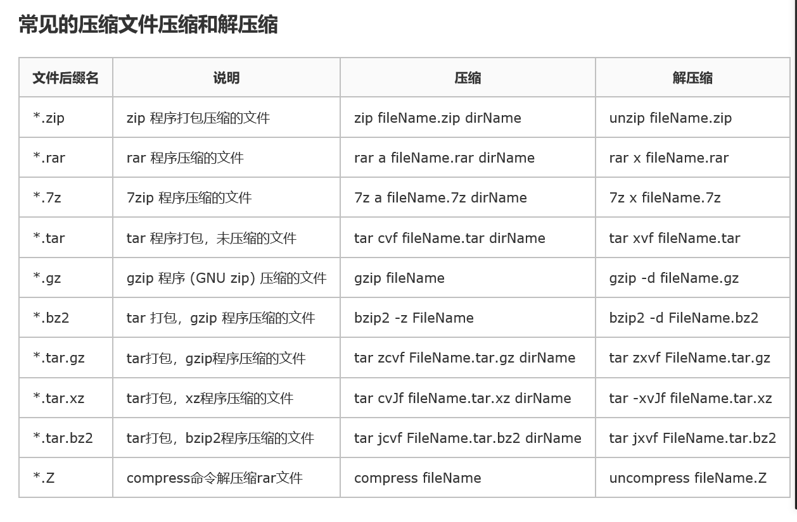
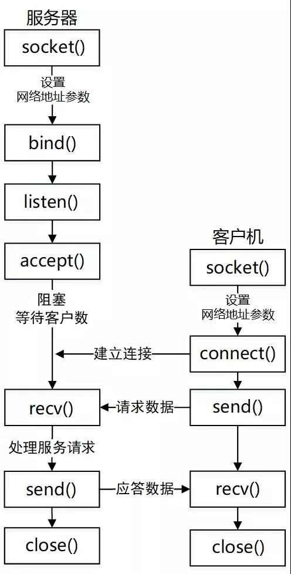
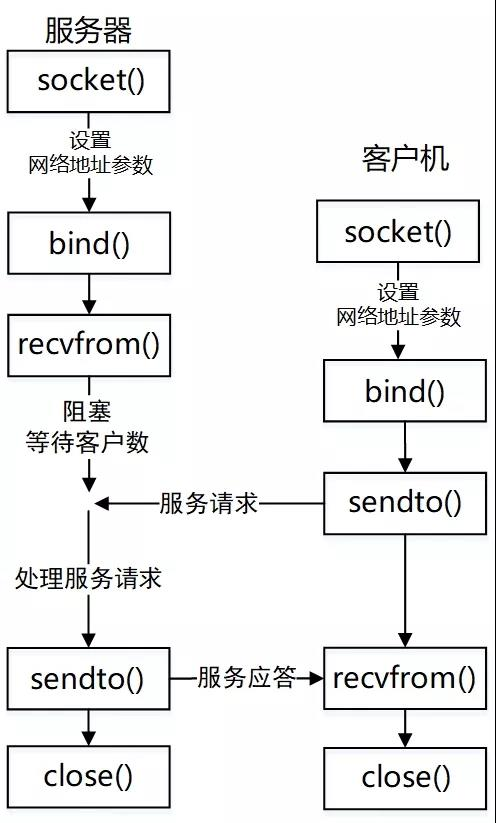
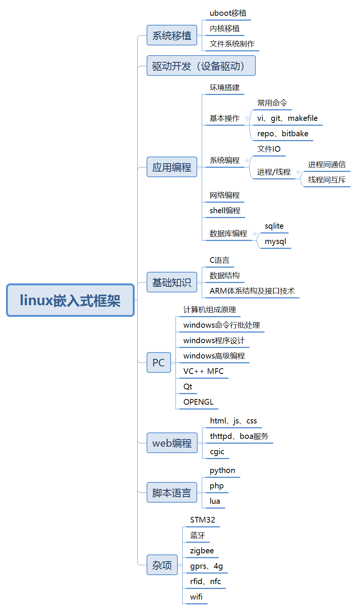
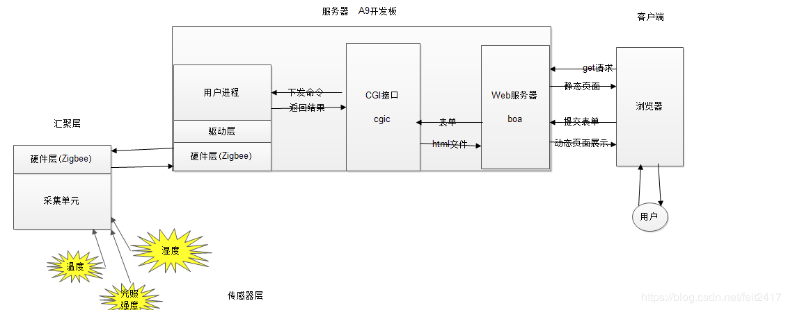

# Linux 杂项学习笔记  
## 1. 添加全局变量  
```vim
    #在profile文件中添加 arm-fsl-linux-gnueabi-gcc 
    export PATH=$PATH:/work/tool/fsl-linaro-toolchain/bin
    #使生效
    $ source /etc/profile
```
## 2. 修改apt-get下载源  
```vim
    $ vi /etc/apt/sources.list
    $ apt-get update
```
## 3. [安装/卸载软件方式](https://www.cnblogs.com/kinwing/p/11829546.html)  
### 安装
* 在线安装  
```vim
    # 在线安装小火车
    $ sudo apt-get install sl
    # 重新安装小火车
    sudo apt-get install --reinstall sl
```
* deb包安装  
```vim
    $ sudo dpkg -i *.deb #或直接双击安装
```
* 源码编译安装
```vim
    $ ./configure
    $ make  
    $ make install
```  
### 卸载[配置文件]
* remove只删除程序文件，保留相关的配置文件
```vim
    $ sudo apt-get remove vim
```
* purge同时删除程序文件及其配置文件
```vim
    $ sudo apt-get purge vim
    # 同上
    $ sudo apt-get remove --purge vim
```
* 删除自动安装的软件包(由于依赖而安装的)
```vim
    $ sudo apt-get autoremvoe
```
### 查看已安装软件  
* 安装或未安装软件版本  
```vim
    # 查看已安装或即将安装包的版本
    $ sudo apt-get -s install tree
    # 安装指定版本
    $ sudo apt-get install tree=1.7.0-5
```
* 查看已安装的软件  
```
    $ dpkg -l
```
## 4. 应用开机启动
```
    系统启动时需要加载的配置文件
    /etc/profile、/root/.bash_profile
    /etc/bashrc、/root/.bashrc
    /etc/profile.d/*.sh、/etc/profile.d/lang.sh
    /etc/sysconfig/i18n、/etc/rc.local（/etc/rc.d/rc.local）
```
* rc.local
```vim
    #!/bin/sh -e
    #
    # rc.local
    #
    # This script is executed at the end of each multiuser runlevel.
    # Make sure that the script will "exit 0" on success or any other
    # value on error.
    #
    # In order to enable or disable this script just change the execution
    # bits.
    #
    # By default this script does nothing.

    #添加开机启动 strat.sh
    /home/root/start.sh &
    exit 0
```
* /etc/profile.d/
```
    将写好的脚本（.sh文件）放到目录 /etc/profile.d/ 下，系统启动后就会自动执行该目录下的所有shell脚本
```
* chkconfig  
```

```
## 5. 网络应用协议  
* FTP  
```
    文件传输协议(File Transfer Protocol)，默认端口号21
```
```vim
    # 搭建ftp服务
    $ sudo apt-get install vsftpd
    $ sudo sevice vsftpd start      #开启ftp服务
    $ sudo netstat -a | grep ftp    #查询ftp服务 
```
* TFTP  
```
    简单文件传送协议TFTP(Trivial File Transfer Protocol)是一个TCP/IP协议族中一个很小且易于实现的文件传送协议。TFTP也是使用客户服务器方式，但它使用UDP数据报，因此TFTP需要有自己的差错改正措施
    TFTP特点：
    1.每次传送的数据PDU中有512字节的数据，但最后一次可不足512字节
    2.数据PDU也称为文件块(block)，每个块按序编号，从1开始
    3.支持ASCII码或二进制传送
    4.可对文件进行读或写
    5.使用很简单的首部
    6.TFTP只支持文件传输而不支持交互
    7.TFTP没有一个庞大的命令集
    8.没有列目录的功能
    9.也不能对用户进行身份鉴别
```
```vim
    # 搭建tftp服务
    $ sudo apt-get install tftp-hpa tftpd-hpa
    $ sudo vi /etc/default/tftpd-hpa    #修改tftp目录
    $ sudo service tftpd-hpa restart    #重启tftp服务
    $ sudo netstat -a | grep tftp       #查询tftp服务
```
> FTP和TFTP区别  
> 1. 交互使用FTP，TFTP仅允许单向传输的文件  
> 2. FTP提供身份验证，TFTP不提供身份验证  
> 3. FTP 使用已知TCP端口号[20]的数据和[21]用于连接对话框。TFTP用UDP 端口号[69]进行文件传输  
> 4. FTP依赖于TCP，是面向连接并提供可靠的控件。TFTP依赖UDP，需要减少开销, 几乎不提供控件  
* SFTP  
```
    Secure File Transfer Protocol的缩写，安全文件传送协议。可以为传输文件提供一种安全的加密方法
```
> FTP和SFTP区别  
> 1. SFTP与FTP有着几乎一样的语法和功能。SFTP为SSH的一部份，是一种传输档案至Blogger伺服器的安全方式。其实在SSH软件包中，已经包含了一个叫作SFTP(Secure File Transfer Protocol的安全文件传输子系统，SFTP本身没有单独的守护进程，它必须使用sshd守护进程（端口号默认是22）来完成相应的连接操作，所以从某种意义上来说，SFTP并不像一个服务器程序，而更像是一个客户端程序
> 2. SFTP同样是使用加密传输认证信息和传输的数据，所以，使用SFTP是非常安全的。但是，由于这种传输方式使用了加密/解密技术，所以传输效率比普通的FTP要低得多，如果您对网络安全性要求更高时，可以使用SFTP代替FTP  
* SCP
```
    scp是secure copy 的缩写, scp是linux系统下基于ssh登陆进行安全的远程文件拷贝命令
```
> SFTP和SCP区别
> 1. scp是一种基于SSH的协议，可在网络上的主机之间提供文件传输。 使用scp，您可以在主机之间快速传输文件以及基本文件属性，例如访问权限和通过FTP无法可用的时间戳。 该协议使用RCP传输文件和SSH以提供身份验证和加密
> 2. sftp是一种更强大的文件传输协议，也基于SSH。 更像是远程文件管理协议，sftp允许对远程文件（查看目录，删除文件和目录等）进行一系列操作  

> SFTP和SCP选择
> 1. 速度考虑。在传输文件时，scp通常比sftp快得多，尤其是在网络延迟很高的情况下。这是因为scp实现了更高效的传输算法，不需要等待数据包确认[选择scp]  
> 2. 安全性考虑。由于两种协议都都基于SSH，因此它们都提供相同的安全功能，包括密码和数据加密以及公钥验证。[选择scp或sftp]  
> 3. 功能/可用性考虑。scp提供的功能像其名称所暗示的那样：安全地复制文件（Secure copy）。如果您或您的用户将管理文件（包括查看/搜索目录，创建文件夹和组织文件，删除或重命名文件等），sftp是优秀的协议。此外，sftp还支持断点续传，这在网络连接不佳的环境中将大有帮助。[选择sftp]  
> 传输文件大小考虑。scp和sftp都没有文件大小限制。但是，根据文件的大小，scp的文件传输速度可能会有所帮助[选择scp]  
* SSH  
```
    远程控制通信协议(Secure Shell)，默认端口号22，SSH1使用RSA加密密钥，SSH2使用数字签名算法(DSA)密钥保护连接和认证
```
```vim
    # 搭建ssh服务
    $ sudo apt-get install openssh-client #安装ssh客户端
    $ sudo apt-get install openssh-server #安装ssh服务端
    $ sudo /etc/init.d/ssh start    # 启动ssh服务
    $ ps -ef | grep ssh #查看是否启动
    $ vi /etc/ssh/sshd_config   #查看修改配置文件
```
* Telnet  
```
    Telnet协议是TCP/IP协议族中的一员，是Internet远程登录服务的标准协议和主要方式，端口号23
```
[搭建telnet服务](https://jingyan.baidu.com/article/48b558e35e51f97f38c09ae7.html)  
> Telnet和SSH区别  
> 1. Telnet和SSH都是用于远程控制的通信协议  
> 2. SSH是加密的,需要交换密钥;而Telnet是明文的,传输的是明文字符  
* samba  
```
    samba是基于SMB协议（ServerMessage Block，信息服务块）的开源软件，samba也可以是SMB协议的商标。SMB是一种Linux、UNIX系统上可用于共享文件和打印机等资源的协议，这种协议是基于Client/Server型的协议，Client端可以通过SMB访问到Server（服务器）上的共享资源
```
* NFS  
```
    网络文件系统，英文Network File System(NFS)，是由SUN公司研制的UNIX表示层协议(presentation layer protocol)，能使使用者访问网络上别处的文件就像在使用自己的计算机一样，默认端口号：2049
```
```vim
    # 搭建nfs服务
    $ sudo apt install nfs-common           #安装客户端
    $ sudo apt install nfs-kernel-server    #安装服务端
    $ sudo vi /etc/exports                  #修改配置文件
    #添加nfs目录: /home/bhky/work/nfs-dir *(rw,sync,no_root_squash,no_subtree_check)
    #
    $ sudo /etc/init.d/rpcbind restart      #重启服务
    $ sudo /etc/init.d/nfs-kernel-server restart   

    $ mount -t nfs localhost:/home/bhky/work/nfs-dir /mnt   #挂载测试方式1
    $ mount -t nfs ip:/home/bhky/work/nfs-dir /mnt  #挂载测试方式2

```
* NTP  
```
    NTP是Network Time Protocol的缩写，又称为网络时间协议。是用来使计算机时间同步化的一种协议，它可以使计算机对其服务器或时钟源（如石英钟，GPS等等)做同步化，它可以提供高精准度的时间校正（LAN上与标准间差小于1毫秒，WAN上几十毫秒），且可介由加密确认的方式来防止恶毒的协议攻击。
    NTP默认使用的端口号是UDP123
```
```vim
    $ sudo apt-get install ntp        #安装服务端软件
    $ sudo apt-get install ntpdate    #安装客户端软件
    $ vi /etc/ntp.conf                #修改配置文件
    $ netstat -ln | grep 123          #查询是否启动方式1
    $ service ntp status              #查询是否启动方式2
    $ netdate ip    #同步时间方式1
    $ ntpdate-sync  #同步时间方式2(修改/etc/default/ntpdate)
    #时区相关
    #/etc/localtime或者查看/etc/profile中TZ
```
## 6. 设备类型 
```
　　/dev/hd[a-t]：IDE设备
　　/dev/sd[a-z]：SCSI设备
　　/dev/fd[0-7]：标准软驱
　　/dev/md[0-31]：软raid设备
　　/dev/loop[0-7]：本地回环设备
　　/dev/ram[0-15]：内存
　　/dev/null：无限数据接收设备,相当于黑洞
　　/dev/zero：无限零资源
　　/dev/tty[0-63]：虚拟终端
　　/dev/ttyS[0-3]：串口
　　/dev/lp[0-3]：并口
　　/dev/console：控制台
　　/dev/fb[0-31]：framebuffer
　　/dev/cdrom => /dev/hdc
　　/dev/modem => /dev/ttyS[0-9]
　　/dev/pilot => /dev/ttyS[0-9]
　　/dev/random：随机数设备
　　/dev/urandom：随机数设备
```
## 7. 文件颜色 
```
    白色:普通文件 
    蓝色:目录 
    绿色:可执行 
    红色:压缩文件 
    浅蓝色:链接文件
    红色闪烁:链接文件有问题
    黄色:设备文件 
    灰色:其他文件
```
## 8.文件类型
```
    七种类型
    1.普通文件类型
        Linux中最多的一种文件类型, 包括 纯文本文件(ASCII)；二进制文件(binary)；数据格式的文件(data);各种压缩文件.第一个属性为 [-]
    2.目录文件
        就是目录， 能用 # cd 命令进入的。第一个属性为 [d]，例如 [drwxrwxrwx]
    3.块设备文件
        块设备文件 ： 就是存储数据以供系统存取的接口设备，简单而言就是硬盘。例如一号硬盘的代码是 /dev/hda1等文件。第一个属性为 [b]
        字符设备
    4.字符设备文件
        即串行端口的接口设备，例如键盘、鼠标等等。第一个属性为 [c]
    5.套接字文件
        这类文件通常用在网络数据连接。可以启动一个程序来监听客户端的要求，客户端就可以通过套接字来进行数据通信。第一个属性为 [s]，最常在 /var/run目录中看到这种文件类型
    6.管道文件
        FIFO也是一种特殊的文件类型，它主要的目的是，解决多个程序同时存取一个文件所造成的错误。FIFO是first-in-first-out(先进先出)的缩写。第一个属性为 [p]
    7.链接文件
        类似Windows下面的快捷方式。第一个属性为 [l]，例如 [lrwxrwxrwx]
```
```
    -:普通文件
    d:目录文件
    l:链接文件
    b:块设备
    c:字符设备
    s:网络文件
    p:管道文件
```
## 9.文件系统自动挂载
```
/etc/fstab
```
## 10.热插拔
```
```
## 11.应用多版本选择
```
    # arm-linux-gnueabi-gcc-7和arm-linux-gnueabi-gcc-5配置和选择
    update-alternatives --install   #进行优先级配置（优先级数字大则为auto mode）
    update-alternatives --config    #进行选择
```
## 12.运行级别
```
    0： 系统停机（关机）模式，系统默认运行级别不能设置为0，否则不能正常启动，一开机就自动关机。
    1：单用户模式，root权限，用于系统维护，禁止远程登陆，就像Windows下的安全模式登录。
    2：多用户模式，没有NFS网络支持。
    3：完整的多用户文本模式，有NFS，登陆后进入控制台命令行模式。
    4：系统未使用，保留一般不用，在一些特殊情况下可以用它来做一些事情。例如在笔记本电脑的电池用尽时，可以切换到这个模式来做一些设置。
    5：图形化模式，登陆后进入图形GUI模式或GNOME、KDE图形化界面，如X Window系统。
    6：重启模式，默认运行级别不能设为6，否则不能正常启动，就会一直开机重启开机重启
```
## 13.man
```
    1是普通的命令
    2是系统调用,如open,write之类的(通过这个，至少可以很方便的查到调用这个函数，需要加什么头文件)
    3是库函数,如printf,fread
    4是特殊文件,也就是/dev下的各种设备文件
    5是指文件的格式,比如passwd,就会说明这个文件中各个字段的含义
    6是给游戏留的,由各个游戏自己定义
    7是附件还有一些变量,比如向environ这种全局变量在这里就有说明
    8是系统管理用的命令,这些命令只能由root使用,如ifconfig
```
```
    简要说明
    NAME:名字和简短介绍
    SYNOPSIS:命令下达语法
    DESCRIPTION:描述
    EXAMPLES:例子
    SEE ALSO:更多可使用的
```
## 14.kill
```vim
    $ killall -g 进程名 #杀掉同一组的进程
```
## 15.时间格式
```
GMT:格林威治标准时间
UTC:世界协调时间
DST:夏日节约时间
CST:代表４个不同时区：
    UT-6:00（美国）
    UT+9:30（澳大利亚）
    UT+8:00（中国）
    UT-4:00 （古巴）
```
## 16.快速查看宏定义
```
    建一个test.c,把需要查看的宏用上，然后gcc -E test.c > test.info,打开test.info查看即可
```
## 17.配置arm为nfs启动
```
    arm上进行nfs配置(可在boot时直接挂在根文件系统,也可以进入系统后挂载)
    1.首先验证可以手动挂载,确保挂载正确
    2.修改menuconfig
        a.启动网络文件系统功能
        b.开启nfs功能(boot)
        c.网络配置(Networking support->Networking options->IP支持)
    3.nfs挂载(uboot配置)
        printenv    #查看环境变量，按如下配置
        baudrate=115200
        boot=$LOAD && $LOAD $fdtaddr $fdtfile && setenv bootargs $mtdparts $params root=/dev/$BOOTARGS && bootm $loadaddr - $fdtaddr
        boot_emmc=LOAD='ext2load mmc 0:1'; BOOTARGS='mmcblk0p1 ro'; run boot
        《boot_net=LOAD=tftp; BOOTARGS="nfs rw ip=192.168.1.60:192.168.1.221:192.168.1.1:255.255.255.0::eth0:off nfsroot=$serverip:$rootpath,nolock"; run boot》
        boot_rom=LOAD=fsload; BOOTARGS='mtdblock1 ro rootfstype=cramfs,jffs2'; run boot
        boot_sata=dcache off; sata init; LOAD='ext2load sata 0:1'; BOOTARGS='sda1 ro'; run boot
        boot_sd=LOAD='ext2load mmc 1:1'; BOOTARGS='mmcblk1p1 ro'; run boot
        boot_sdmmc=LOAD='ext2load mmc 2:1'; BOOTARGS='mmcblk3p1 ro'; run boot
        boot_usb=usb start; LOAD='ext2load usb 0:1'; BOOTARGS='sda1 ro'; run boot
        bootcmd=run boot_net
        bootdelay=1
        bootfile=/boot/uImage
        ethact=FEC
        ethaddr=00:30:64:14:bf:a2
        ethprime=FEC
        fdt_high=0xffffffff
        fdtaddr=0x18000000
        fdtfile=/boot/lec-imx6q.dtb
        initrd_high=0xffffffff
        《ipaddr=192.168.1.60》
        loadaddr=0x12000000
        mtdparts=mtdparts=spi32765.0:384K(u-boot)ro,-(root)
        《netmask=255.255.255.0》
        params=rootwait console=ttymxc0,115200
        《rootpath=/home/bhky/work/nfs-dir》
        《serverip=192.168.1.221》
        stderr=serial
        stdin=serial
        stdout=serial
```
## 18.i2ctools
```
    # i2cdump、i2cget、i2cset和i2cdetect使用
```
## 19.canutils
```
    # cansend和candump使用
```
## 20.内核添加驱动源码和驱动配置
```
    1.在drivers下面新建一个文件夹 mkdir gpiotest
    2.将驱动源码添加进gpiotest
    3.新建Kconfig和Makfile文件
        Kconfig格式仿照其他Kconfig写
        Makfile格式仿照其他Makfile写
    4.将gpiotest添加进drivers下面的Kconfig
        source "drivers/gpiotest/Kconfig"
    5.将gpiotest添加进drivers下面的Makefile
        obj-$(CONFIG_GPIOTEST)	+= gpiotest/
        通过menuconfig就可以在Device Drivers最后看到 新添加的gpio选项
```
## 21.手动加载/移除模块
```vim
    #方式1
    insmod drv.ko   #安装模块
    rmmod drv.ko    #移除模块
    #方式2
    modprobe drv    #安装模块，模块是放在/lib/modules/`uname -r`/, 然后需要先depmod
    rmmod drv       #移除模块
```
## 22.虚拟文件系统
* /proc/kallsyms
```
    CONFIG_KALLSYMS=y 符号表中包含的所有函数
    CONFIG_KALLSYMS_ALL=y 符号表中包含的所有变量（包括没有用到EXPORT_SYSBOL导出的变量）
    CONFIG_KALLSYMS_EXTRA_PASS=y
```
## 23.运算符优先级
```
    先指针，单双目
    先算术，后移位
    比大小，判相等
    位操作，逻辑跟
    多赋值，逗号底
    单多赋，右到左
```
## 24.inetl网卡(i210)移植
```
	1.lspci 查看是否有pci id为8086:153x
	2.通过EEUPDATE更新i210配置(invm和flash两种),工具在intel官网下载
	3.内核中添加对应的驱动
```
## 25.交叉编译工具链
* 各版本arm-gcc区别
```

```
* 安装方式

* 最新/常用版本
## 26.ip设置
```
    静态ip
    dhcp
    注：在连接到支持dhcp的路由上时，怎么使用
```
## 27.[stty](https://baike.baidu.com/item/stty)
```
    打印或更改terminal(终端)的设置
```
## 28.485转向
```
    有三种方式实现收发转向
    1.DCE模式
        TX  <---> RO (485转换芯片PIN1)
        RX  <---> DI (485转换芯片PIN4)
        RTS <---> RE/DE (485转换芯片PIN2和PIN3,PIN2和PIN3短接)
        RTS作为普通IO,手动输出高低实现收发转向控制(应用层控制GPIO)
    2.DCE模式(imx6只有在DCE时可以,手册上有说明)
        TX  <---> RO (485转换芯片PIN1)
        RX  <---> DI (485转换芯片PIN4)
        CTS <---> RE/DE (485转换芯片PIN2和PIN3,PIN2和PIN3短接)
        采用硬件流控,驱动层实现自动转向
    3.DTE模式
        RX  <---> RO (485转换芯片PIN1)
        TX  <---> DI (485转换芯片PIN4)
        RTS <---> RE/DE (485转换芯片PIN2和PIN3,PIN2和PIN3短接)
        采用硬件流控,驱动层实现自动转向
```
## 29.文件系统
```
    在嵌入式linux应用中，主要的存储设备为RAM和FLASH。常用的基于存储设备的文件系统类型包括：jffs2，yaffs，cramfs，ramdisk，ramfs等。
    1.jffs2：日志闪存文件系统版本2，用于NOR flash，可读写、支持数据压缩的日志文件系统
    2.yaffs/ubitFS：用于nand flash设计的一种日志型文件系统，不支持数据压缩
    3.Cramfs:只读的压缩文件系统（用的越来越少）
    4.Ramdisk：将部分固定大小的内存当做块设备来使用
    5.Initramfs：将内存当做块设备用（现在用的多）
    6.NFS：网络文件系统 (开发阶段使用)
```
## 30.常见压缩
  
## 31.TCP流程
  
## 32.UDP流程  
  
## 33.Visual Studio 2013
* 使用
```
    1.文件->项目->Vistual C++->空项目
    2.添加头文件
        项目右键->属性->配置属性->C/C++->常规->附加包含目录
    3.添加lib库
        项目右键->属性->配置属性->链接器->常规->附加包含目录
    4.添加源/头文件
        源文件右键->添加->新建项->cpp/h文件
    5.boost库
        boost_1_55_0-msvc-12.0-64.exe
```
## 34.嵌入式框架(总结)
  
* [学习linux应用编程](https://blog.csdn.net/yychuyu/article/details/80636496)
```vim
对于Linux应用的学习，主要有六部分：1. 环境搭建；2. 基本操作；3. 系统编程；4. 网络编程；5. 数据库编程，6. Shell编程。下面一一详细介绍。
1. 环境搭建
作为Linux工程师，毋庸置疑一定需要Linux环境。对于Linux环境的获取，我们通常有两种方式：
* 将电脑整体安装为Linux系统；
* 在电脑里安装一个虚拟机，跑Linux电脑；
* Window+Linux双系统。
得到Linux环境后还不够，还要知道如何配置、如何远程连接Linux电脑、如何与Linux电脑互传文件、如何在主机上阅读Linux电脑中的代码，等等。

2. 基本操作
众所周知，Linux很少或几乎没有界面，所有的操作几乎都可以通过命令行来完成。对于运维人员来说，需要掌握相当大量的Linux命令。而对于应用、驱动方向的人员来说，只需掌握一些基本的常用的命令即可。对于这部分很多人建议看 「鸟哥的私房菜」 ，但我觉得这个更适合运维人员，我们无需掌握那么多命令。

3. 系统编程
在学系统编程之前，一定要先学习Makefile，这会为后续的学习提高很大效率。之后的系统编程，主要有几大块：IO编程、进程、线程、进程间通讯（包括管道、信号、信号量、共享内存等）。这几部分学完了，基本也就差不多了。

4. 网络编程
网络编程主要就是socket，poll，epoll，以及对TCP/IP的理解，同时要学会高并发式服务器的编写。进程池，线程池的理解。

5. 数据库编程
数据库的内容其实并不属于Linux，但在项目中经常要用到。这部分主要要学会数据库的基本操作，以及如何写一套接口去操作数据库。

6. Shell编程
Shell是Linux下的脚本语言，功能虽然不如高级语言强大，但它可能做很多事，在某些场合甚至比高级语言要方便得多。当然除了Shell脚本，还有Python脚本。

Linux应用编程书籍推荐：
* UNIX环境高级编程。简称APUE，号称程序员的圣经。它不是一本API字典，它还讲述了很多操作系统的细节，内存，文件系统等方面，是一本难得的好书。但是它起点有点高，不适合初学者。
* Linux程序设计。如果觉得APUE有点难入门的话，可以选择此书进行入门。
* Unix/Linux系统编程手册。这本书号称是一本超越APUE的书，它是一本比较新的书，里面新增了APUE所没有的Linux/Unix新特性。而且对于一些概念性的东西讲的确实比APUE好。但至于能否超载APUE，还有待历史的考验。
* UNIX 网络编程。也是一本非常经典的书，主要是网络编程方向的。简称UNP
* MySQL必知必会。本书在Amazon上长期排在数据库销售榜首，建议想快速了解数据库原理和MySQL的新手阅读。快餐性质，简洁明快，小开本，而且很薄，比较好阅读。
* Linux Shell脚本攻略。这本书很薄很精华，它追求的不是全，而是精，所以用它来入门再适合不过了。

学完以上六部分，基本就有能力完成Linux环境下的应用编程了。当然，在有些场合我们可能还需要用到Python脚本。像我公司的项目部分脚本就是用Python完成的。对于Python的入门，可以参考 「简明Python教程」。但如果想进一步提高的话，那就需要阅读大量书籍了。对于Linux层级的脚本应用，掌握一些基础的足够了。
```
* [学习linux内核](https://blog.csdn.net/xzjj2007/article/details/48438311)
```
* 了解操作系统基本概念  
    如果不会，可以学习《操作系统：设计与实现》Andrew S.Tanenbaum 写的那本。以MINIX为例子讲解操作系统的概念。非常推荐。
* 了解Linux内核机制  
    有了操作系统的基本概念以后，可以了解Linux的机制了。推荐《Linux内核设计与实现》Robert Love 写的。这本书从概念上讲解了Linux有什么，他们是怎么运行的。这本书要反复认真看透。
* 研究Linux内核源码  
    有了Linux内核的了解，还需要具体研究Linux内核源码。最经典的就是《深入理解Linux内核》Daniel P. Bovet 写的。学习这本书的时候，要对着内核代码看着学。这本书学起来相当费力了，那么多多代码要研究。不过这本书如果学明白了，恭喜你，Linux内核你已经很熟悉了。
* 设备驱动方向学习 
    如果要开发设备驱动，可以学习《linux设备驱动程序》O’Reilly出版社的。这本作为驱动的入门是很好的资料。另外还有一本《精通 Linux 驱动程序开发》也是不错的教材，可以参考着看。学习驱动，免不了要学习一些硬件的协议和资料，研究哪个就找到相应的硬件文档，把硬件的工作原 理搞明白。这些就不细说了。
* 网络方向学习  
    网络部分，学些Linux网络部分就学习《深入理解LINUX网络技术内幕》。这本书把Linux的网络部分讲的非常清晰透彻。但是通常不做这方面的工作研究，也不用研究这么深，毕竟现在国内相关职位较少。
* 嵌入式开发 
    现在Linux相关的工作，多集中在一些嵌入式开发领域，arm，mips等，要学习以下这些体系架构的的资料，了解CPU的设计和工作方式。 ARM就看对应的芯片手册，讲的很细致。MIPS就看 《see mips run》，有一二两版，两版内容有些差异，推荐都看。
* 补充一点经验 
    不要认为Linux很庞大，很复杂，就觉的很难学。任何东西认真学下来都是能学会的，看你的恒心和毅力了。另外，不要走弯路，不要看 市面上讲什么Linux0.11的那些书，直接学你要学的东西。就像学C语言看什么谭浩强一样，弯路走了，力气没少花，还严重影响学习效果。
你问的内核，多给你说几句应用编程，有时候经常会需要的： 
    1. 学习Linux应用编程，建议看《unix环境高级编程》，把里面的例子都做一遍，会对整个Linux编程有系统都认识。 
    2. 针对Linux，有本 《Linux系统编程》，学完上一本，这本很快看一遍就懂了。主要是针对Linux具体懂一些内容，讲的挺全了，很实用。 
    3. Linux网络编程，系统的学习一下《unix网络编程.卷1,套接字联网api》，基本上网络应用相关的程序就都没问题了。
```
* [linux学习之路](https://blog.csdn.net/Rock_Ling/article/details/79569995)
## 35.[cgi](https://github.com/boutell/cgic.git)
  
## 36.字节对齐
* [字节对齐背景知识](https://www.cnblogs.com/clover-toeic/p/3853132.html)
```vim
    字节对齐的问题主要就是针对结构体
```
* 对齐准则说法1  
```
    1.数据类型自身的对齐值：char型数据自身对齐值为1字节，short型数据为2字节，int/float型为4字节，double型为8字节。
    2.结构体或类的自身对齐值：其成员中自身对齐值最大的那个值。
    3.指定对齐值：#pragma pack (value)时的指定对齐值value。
    4.数据成员、结构体和类的有效对齐值：自身对齐值和指定对齐值中较小者，即有效对齐值=min{自身对齐值，当前指定的pack值}。
```
* 对齐准则说法2
```
    1.结构体变量的首地址能够被其最宽基本类型成员的大小所整除；
    2.结构体每个成员相对结构体首地址的偏移量(offset)都是成员大小的整数倍，如有需要编译器会在成员之间加上填充字节(internal adding)；
    3.结构体的总大小为结构体最宽基本类型成员大小的整数倍，如有需要编译器会在最末一个成员之后加上填充字节{trailing padding}。
```
* 字节对齐方式
> * 方式1  
> 使用伪指令#pragma pack(n)：C编译器将按照n个字节对齐；  
> 使用伪指令#pragma pack()： 取消自定义字节对齐方式。
```vim
    //按2字节对齐
    #pragma pack(2)  //指定按2字节对齐
    struct C{
        char  b;
        int   a;
        short c;
    };
    #pragma pack()   //取消指定对齐，恢复缺省对齐
```
```vim
    //按8字节对齐
    #pragma pack(8)
    struct D{
        char  b;
        short a;
        char  c;
    };
    #pragma pack()
    //虽然#pragma pack(8)，但依然按照两字节对齐，所以sizeof(struct D)的值为6。因为：对齐到的字节数 = min｛当前指定的pack值，最大成员大小｝
```
> * 方式2(GCC特有语法)  
> \_\_attribute__((aligned (n)))：让所作用的结构成员对齐在n字节自然边界上。如果结构体中有成员的长度大于n，则按照最大成员的长度来对齐  
> \_\_attribute__ ((packed))：取消结构在编译过程中的优化对齐，按照实际占用字节数进行对齐
```vim
    //按1字节对齐(GCC)
    #define GNUC_PACKED __attribute__((packed))
    struct C{
        char  b;
        int   a;
        short c;
    }GNUC_PACKED;
```
