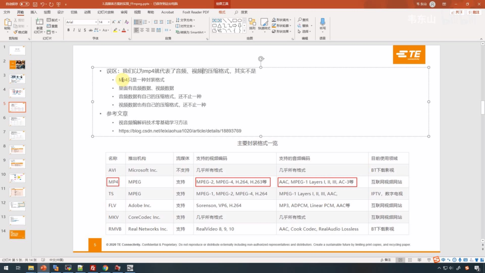

# 应用和驱动笔记
## 1.常见问题
### 1.1 主进程退出时,如何保证子进程退出,而不成为孤儿进程  
```
```

### 1.2 孤儿进程如何退出或杀死  
```
```

### 1.3 僵尸进程能杀死吗
```
```

### 1.4 在设备树中未定义，是否可以直接在应用层使用，定义和不定义的区别是什么
```vim
    1.在设备树中定义
        at24c08@54 {/* 1KB EEPROM */
            compatible = "atmel,24c08";
            reg = <0x54>;
            pagesize = <16>;
        };
    2.不在设备树中定义

    结论：
        使用哪种驱动框架，是否注册了cdev，否则在/dev/下没有对应的设备节点
```


### 1.5 进程(意外)退出时需要释放哪些资源
```
```

### 1.6 嵌入式linux下程序设计
```
    精通嵌入式linux开发环境包括：
    1.系统编程、文件IO、多进程和多线程、网络编程、GUI图形界面编程、数据库
    2.熟悉常用的图形库编程，如QT、GTK、miniGUI、fltk、nano-x等，掌握各种应用层的网络协议以及各种音视频技术等
```

### 1.7 两个线程顺序打印26个字母（通知机制），那三个线程、四个线程怎么处理

### 1.8 红黑树

### 1.9 线程池

### 1.10 操作系统分页

## 2.应用编程
> **应用编程大致涉及到的内容**

| 内容| 说明 |
| :-- | :-- |
| Framebuffer编程 | |
| 图像处理 | |
| 输入系统 | |
| 进程通信 | |
| 多线程编程 | |
| 网络编程 | |
| 摄像头V4L2编程 | |
| 声卡ALSA编程 | |
| GPIO编程 | |
| RTC编程 | |
| PWM编程 | |
| I2C编程 | |
| 串口和485编程 | |
| CAN编程 | |
| 存储设备 | |
| MQTT协议 | |


> **推荐书籍**


> **一些开发板**


### 2.1 外设编程
#### 2.1.1 GPIO
```vim
    1.对应关系
        公式：32*(n-1)+x
        n：GPIO1-y
        x：IO0-31
    2.GPIO的配置
        导出GPIO
            在/sys/class/gpio目录下可以看到文件export，调用该文件以实现配置
            该文件对所有GPIO编号，从0开始。GPIOn_x的编号为32*(n-1)+x，例如此处用的GPIO2_6的编号为32*1+6=38
            # echo "38" > /sys/class/gpio/export
            回到目录/sys/class/gpio下，可以看到产生了一个新的目录./gpio38，里面包含了该IO口的输入输出设置等配置文件
            注意：export文件只有root写权限，执行上述命令或者以后用C编写的可执行文件要以ROOT身份执行
        设置GPIO的方向（输入输出）
            # echo "out" > /sys/class/gpio/gpio38/direction，设置该GPIO为输出
            # echo "in" > /sys/class/gpio/gpio38/direction，设置该GPIO为输入
        设置GPIO的输出电平
            # echo "1" > /sys/class/gpio/gpio38/value，设置GPIO输出高电平
            # echo "0" > /sys/class/gpio/gpio38/value，设置GPIO输出低电平
        设置中断方式
            # echo  "rising" > /sys/class/gpio/gpio38/edge，设置GPIO为上升沿中断
            # echo  "falling" > /sys/class/gpio/gpio38/edge，设置GPIO为下降沿中断
            # echo  "both" > /sys/class/gpio/gpio38/edge，设置GPIO为双边沿中断
            # echo  "none" > /sys/class/gpio/gpio38/edge，设置GPIO为无中断
        关闭GPIO
            # echo "38" > /sys/class/gpio/unexport，删除GPIO配置文件，可以看到目录gpio38已经被删除
```
#### 2.1.2 I2C
* **PCA9535（IO扩展）**
* **AT24C08（e2prom）**
* **pcf8563（rtc芯片）**

#### 2.1.3 SPI

#### 2.1.4 串口（TTL、232和485）

#### 2.1.5 CAN

#### 2.1.6 RTC

#### 2.1.7 看门狗
#### 2.1.8 USB
* **摄像头** 
* **4G模块**

#### 2.1.9 wifi
* **串口** 
* **sdio**
* **usb**

#### 2.1.10 hdmi/vga

#### 2.1.11 mic

#### 2.1.12 sd、emmc

#### 2.2.13 sata

#### 2.1.14 mipi csi摄像头

#### 2.1.15 adc

### 2.2 系统编程
#### 2.2.1 文件操作
#### 2.2.2 目录操作
#### 2.2.3 时间操作
* **定时任务**
* **时间操作函数**

#### 2.2.4 string字符串操作
#### 2.2.4 进程及进程间通信
* **进程基础知识**
* **信号**
* **信号量**
```
    信号量分类及应用场景
```
* **共享内存**
* **消息队列**
* **PIPE无名管道**
* **FIFO管道**
* **socket通信**

#### 2.2.5 线程及线程间互斥、同步
* **线程基础知识**
* **互斥锁(量)**
```
    互斥锁(量)分类及应用场景
```
* **条件变量**
* **读写锁**
* **自旋锁**
* **栏杆锁**
* **信号量和互斥量的区别**

### 2.3 网络编程
* 2.3.1 socket网络编程
> * 进程池
> * 线程池
> * poll、select、epoll
> * 常用库

### 2.4 数据库编程
#### 2.4.1 sqlite3数据库编程

### 2.5 视频编程
#### 2.5.1 ffmpeg


#### 2.5.2 mjpeg


#### 2.5.3 视频基础




#### 2.5.4 v4l2

### 2.6 其它
#### 2.6.1 调用可执行程序

### 2.7 qt编程

### 2.8 日志框架

### 2.9 调试方式

### 2.10 web开发


### 2.11 注意事项
* read返回负数

## 3.系统移植
### 3.1 uboot
#### 3.1.1 uboot下载、移植
#### 3.1.2 常用命令
#### 3.1.3 启动位置选择
* **spi-nor-flash**
* **sd**
* **emmc**
* **otg**

### 3.2 kernel
#### 3.2.1 内核下载、移植
#### 3.2.2 内核剪裁
#### 3.2.3 驱动（设备树）
### 3.3 rootfs
#### 3.3.1 文件系统制作
* busybox
* buildroot
* yocto

## 4. 驱动笔记
### 4.1 五大IO模型


### 4.2 中断
* **中断类型**


### 4.3 驱动框架


### 4.4 平台驱动


### 4.5 I2C驱动


```
    线程相关
    0.线程资源包括哪些
    线程描述符，子线程内部单独申请的堆栈内存（malloc、realloc、calloc)和锁资源mutex；

    1.子线程退出后未回收资源，主线程(最后一个线程)退出时，会回收未回收的子线程资源吗？
    1.1 理论上是会回收的(没听过僵尸线程)
    1.2 最好设置线程的分离状态，这样就不用考虑是否回收了
    1.3 要考虑一直创建线程和取消线程情况，如果不及时清理，会出现线程上限，导致创建失败

    2.子线程清理函数
    触发条件
    pthread_cancel(测试点退出还是立即退出)
    pthread_exit
    pop不为0

    3.可cancel
    pthread_setcanceltype
    异步取消，不等到取消点
    延迟取消，等到取消点

    4.回收
    主动回收(并不改变锁状态，可显式修改)
    分离状态
    pthread_detach
    创建线程时，设置属性分离

    被动回收
    pthread_jion

    5.线程锁和条件变量用宏初始化和pthread_mutex_init初始化区别，是否都在所有线程退出时释放所占内存

    6.线程创建时，默认分配的堆栈大小
    ulimit -s查看
```

* 杂项笔记
```
1.信号量(posix)
无名信号量用于线程同步
有名信号量用于进程同步
P阻塞 V唤醒
有名
sem_unlink 
sem_open
sem_close
无名
sem_init
sem_destroy
公用
sem_wait
sem_post

2.共享内存
最快的IPC方式
system v
shmget 创建
shmat 映射
shmdt 解除映射
shmctl 删除，设置参数，保存参数，锁定，解锁
数据结构shmid_ds

posix
有亲缘关系的进程
匿名映射
直接mmap

无亲缘关系进程
shm_open
ftruncate
mmap
close
shm_unlink

munmap
msync

3.消息队列
MSGMAX一条消息的最大长度
MSGMNB一个队列的最大长度
MSGMNI消息队列个数
system v
msgget创建
msgsnd发送消息
msgrcv接收消息
msgctl获取参数，设置参数，删除
数据结构msgid_ds
posix
/proc/sys/fsmqueue/msg_max消息数最大限制
/proc/sys/fsmqueue/msgsize_max消息最大长度
消息队列名称前必须加斜杠/
mq_open 打开
mq_getattr 获取属性
mq_setattr 设置属性
mq_send 发送
mq_receive 接收
mq_close 关闭
mq_unlink 删除

接收进程也要先打开msg_open，才能msg_receive(无亲缘关系的)
父子进程直接收发

4.信号
一种比较复杂的通信方式，用于通知接收进程某个事件已经发生
signal.h是一个信号列表(kill -l)
1-31普通 34-64实时
信号处理机制
忽略信号(SIGILL和SIGSTOP不能忽略)
默认动作(大多数是终止进程)
捕捉信号signal函数

信号集
posix
raise给自己发信号
abort给自己异常终止
sigemptyset
sigfillset
sigaddset
sigdelset
sigismember

system v
kill给指定进程发信号
sigprocmask
sigpending
signal 给某一个信号注册一个函数
sigaction 对某一个信号的响应机制
pause 挂起，等待任意信号处理返回
alarm
setitimer定时设置

5.管道
pipe 半双工，单向流动，亲缘进程(父子进程)
named pipe 半双工，允许非亲缘进程通信
pipe函数
mkfifo函数

6.socket

7.网络 
socket
web+js（cgi）

8.文件IO(操作)
多进程写一个文件，互斥
unlink 删除文件
remove (删文件调用unlink，删目录调用rmdir)
ftw 遍历文件
根据stat结构体，确定改变时间再判断名字，进行确认是否是某一天创建的文件(直接判断文件名)

9.数据库sqlite3

10.进程
注意持续性？
进程监控
僵尸进程
进程结束，线程立即结束
fork 建立进程

11.线程
注意持续性？
pthread_create
pthread_cancel
pthread_join

12.定时任务使用
select
setitimer搭配signal或者sigaction使用

14.常用技术
v4l2
freetype
Qt
```