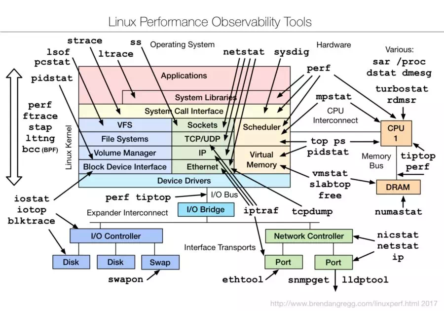

# debug-notes
## 1.gdb使用
* [调试器GDB的基本使用方法](https://www.cnblogs.com/arnoldlu/p/9633254.html)
* [GDB基本用法](https://www.cnblogs.com/euphie/p/9781482.html)
* [LINUX下GDB的使用方法(简单说说)](https://blog.csdn.net/awm_kar98/article/details/82840811)
* [LinuxGDB 用法详解(5小时快速教程)](http://witmax.cn/gdb-usage.html)
## 2.[段错误](https://www.cnblogs.com/liangyc/p/11631872.html)
* 定义
```
    段错误: Segmentation Fault，段错误是指访问的内存超出了系统给这个程序所设定的内存空间，例如访问了不存在的内存地址、访问了系统保护的内存地址、访问了只读的内存地址等等情况
```
* 段错误产生原因
```
1.访问不存在的内存地址
2.访问系统保护的内存地址
3.访问只读的内存地址
4.栈溢出
```
* 段错误信息的获取
```
1.dmesg
    dmesg可以在应用程序crash掉时，显示内核中保存的相关信息。如下所示，通过dmesg命令可以查看发生段错误的程序名称、引起段错误发生的内存地址、指令指针地址、堆栈指针地址、错误代码、错误原因等
2.-g(加入gdb调试信息)
    使用gcc编译程序的源码时，加上-g参数，这样可以使得生成的二进制文件中加入可以用于gdb调试的有用信息
3.nm
    使用nm命令列出二进制文件中的符号表，包括符号地址、符号类型、符号名等，这样可以帮助定位在哪里发生了段错误
4.ldd
    使用ldd命令查看二进制程序的共享链接库依赖，包括库的名称、起始地址，这样可以确定段错误到底是发生在了自己的程序中还是依赖的共享库中
```
* 段错误的调试方法
```
1.使用printf输出信息
2.使用gcc和gdb
    适用场景
        * 仅当能确定程序一定会发生段错误的情况下使用。
        * 当程序的源码可以获得的情况下，使用-g参数编译程序。
        * 一般用于测试阶段，生产环境下gdb会有副作用：使程序运行减慢，运行不够稳定，等等。
        * 即使在测试阶段，如果程序过于复杂，gdb也不能处理
3.使用core文件和gdb
    流程
        * 在一些Linux版本下，默认是不产生core文件的，首先可以查看一下系统core文件的大小限制
        $ ulimit -c
        * 设置下core文件的大小限制（单位为KB）
        $ ulimit -c 1024
        * 发生段错误生成core文件
        * 加载core文件，使用gdb工具进行调试
        $ gdb ./target ./core
        * 完成调试后，输入quit命令退出gdb
    适用场景
        * 适合于在实际生成环境下调试程序的段错误（即在不用重新发生段错误的情况下重现段错误）
        * 当程序很复杂，core文件相当大时，该方法不可用
4.使用objdump
    流程
        * 使用dmesg命令，找到最近发生的段错误输出信息
        * 使用objdump生成二进制的相关信息，重定向到文件
        * 在objdump重定向的文件中查找发生段错误的地址
        * 找到汇编指令对应的源码，也就定位到段错误
    适用场景
        * 不需要-g参数编译，不需要借助于core文件，但需要有一定的汇编语言基础
        * 如果使用了gcc编译优化参数（-O1，-O2，-O3）的话，生成的汇编指令将会被优化，使得调试过程有些难度
5.使用catchsegv
    $ catchsegv ./target
```
* 注意事项
```
1.出现段错误时，首先应该想到段错误的定义，从它出发考虑引发错误的原因
2.在使用指针时，定义了指针后记得初始化指针，在使用的时候记得判断是否为NULL
3.在使用数组时，注意数组是否被初始化，数组下标是否越界，数组元素是否存在等
4.在访问变量时，注意变量所占地址空间是否已经被程序释放掉
5.在处理变量时，注意变量的格式控制是否合理等
```
## 3.[linux后台常用调试工具](https://www.cnblogs.com/kevenzhou/p/10763410.html)
* 1.编译阶段  
```
nm          获取二进制文件包含的符号信息
strings     获取二进制文件包含的字符串常量
strip       去除二进制文件包含的符号
readelf     显示目标文件详细信息
objdump     尽可能反汇编出源代码
addr2line   根据地址查找代码行
```
* 2.运行阶段
```
gdb         强大的调试工具
ldd         显示程序需要使用的动态库和实际使用的动态库
strace      跟踪程序当前的系统调用
ltrace      跟踪程序当前的库函数
time        查看程序执行时间、用户态时间、内核态时间
gprof       显示用户态各函数执行时间
valgrind    检查内存错误
mtrace      检查内存错误
```
* 3.其他
```
proc文件系统
系统日志
```
* 4.性能检测工具一览表

## 4.[死锁](https://www.cnblogs.com/lovedesy123/p/7752077.html)
```
    如何检查线程是否死锁
```
## 5.[后台服务启动方式systemd、daemon、nohup](https://www.pianshen.com/article/76671272980/)
```
后台运行服务的基本需求：
    * 脱离终端（终端关闭时，服务不能关闭）
    * 处理输入、输出、出错描述符

systemd
    自己本身就是一个init或者user级的subreaper；
    系统级systemd启动的服务以root权限运行；
    重定向输入到/dev/null，输出、出错通过socket发给系统日志模块。

daemon
    通过fork后父进程exit，让子进程托孤给subreaper，实现在后台运行服务
    重定向输入、输出、出错到/dev/null.
    [源码参考](https://github.com/lattera/glibc/blob/master/misc/daemon.c)

nohup
    通过忽略终端关闭时的广播信号SIGHUP，实现在后台运行服务。
    重定向输入到/dev/null，输出、出错重定向到当前目录下的nohup.out文件

后台运行服务的高级需求：
    * 方便分析问题的服务运行日志记录
    * 服务管理的日志
    * 异常退出时可以根据需要重新启动

总结：
    daemon 不能实现上面的高级需求
    nohup 只能记录服务运行时的输出和出错日志
    只有systemd能够实现上述所有需求
        默认的日志中增加了时间、用户名、服务名称、PID等，非常人性化，还能看到服务运行异常退出的日志，还能通过/lib/systemd/system/下的配置文件定制各种需求
```
## 6.[交叉工具链使用](https://blog.csdn.net/lushoumin/article/details/81866864)
* 交叉编译工具
```
arm-linux-gcc
arm-linux-addr2line
arm-linux-objcopy
arm-linux-readelf
arm-linux-ar
arm-linux-ld
arm-linux-objdump
arm-linux-size
arm-linux-nm
arm-linux-strip
arm-linux-cc
arm-linux-gprof
arm-linux-c++filt
arm-linux-as
arm-linux-cpp
arm-linux-gccbug
arm-linux-ldd
arm-linux-populate
arm-linux-strings
arm-linux-c++
arm-linux-g++
arm-linux-gcov
arm-linux-ranlib
```
* 使用
```
arm-linux-gcc
    和X86平台下的gcc的基本用法用法是完全一样的；
    不同之处：
        标准的gcc所引用的头文件路径为 /usr/include/stdio.h，
        arm-linux-gcc所引用的头文件路径为其安装路径下，如 /usr/local/armtools/4.5.1/bin/..

arm-linux-ld
    arm-linux-ld命令是ARM平台下的交叉链接器，把程序链接成可以在ARM平台下运行

arm-linux-readelf
    $ arm-linux-readelf -a led.elf
    -a 参数是查看.elf文件的所有内容
注意：
    编译的程序运行不了有两个原因：一个是要看运行平台对不对，第二个是要看处理器的大小端跟编译的程序的大小端是否对应，可以使用arm-linux-readelf -h xxx.elf 命令查看编译出来的程序大小端情况和程序运行平台
    如一个应用程序不能执行，排除了运行平台和大小端的情况后，还有可能是库不对。使用arm-linux-readelf -d xxx (xxx为编译后可执行文件)查看运行库

arm-linux-objdump
    把hello.c文件编译成hello可执行文件：arm-linux-gcc hello.c -o hello
    用法：
        $ arm-linux -objdump -D -S hello >dump
        把hello可执行文件反汇编后输入保存到dump文件中。
        -D -S 是反汇编参数，>dump 把hello反汇编后的内容保存到dump文件中

arm-linux-objcopy
    使用arm-linux-objcopy命令可以把ELF格式的文件转换成二进制文件
    文件格式转换的原因：elf格式的文件不能直接在ARM上运行（ARM只能运行二进制格式的文件）
    用法：
        $ arm-linux-objcopy -O binary led.elf led.bin
        把led.elf格式的文件转换成led.bin二进制文件

arm-linux-ar
    arm-linux-ar将多个可重定位的目标模块归档为一个函数库文件。采用函数库文件，应用程序能够从该文件中自动装载要参考的函数模块，同时将应用程序中频繁调用的函数放入函数库文件中，易于应用程序的开发管理。arm-linux-ar支持ELF格式的函数库文件

```
* 思考
> 1.防止反汇编  
> 2.[elf文件和二进制文件区别](https://blog.csdn.net/sunny04/article/details/27548919)  
> 3.带调试信息的程序和不带的区别  
> 4.查看静态库中的内容  
> 5.查看动态库中的内容  
## 7.静态库和动态库使用
* 静态库
> * **1.静态库优缺点**  
>   静态库在编译的时候，主程序文件与静态库一起编译，把主程序与主程序中用到的库函数一起整合进了目标文件  
>   *优点*：  
>        在编译后的可执行程序可以独立运行，因为所使用的函数都已经被编译进去了  
>        静态链接相当于复制一份库文件到可执行程序中，不需要像动态库那样有动态加载和识别函数地址的开销，也就是说采用静态链接编译的可执行程序运行更快。  
>   *缺点*:  
>         静态链接生成的可执行程序比动态链接生成的大很多，运行时占用的内存也更多
>         如果所使用的静态库发生更新改变，我们的程序必须重新编译
> * **2.静态库命名**  
> 静态库文件名的命名方式是“libxxx.a”，库名前加”lib”，后缀用”.a”，“xxx”为静态库名
> * **3.编译生成静态库**
> ```vim
>   # 单个文件生成库
>   gcc -c -o libstatic.a static.c
>   # 多个文件生成库
>   # 1.生成编译文件
>       %.o:%.c
>           gcc -c -o $@ $^
>   # 2.打包多个编译文件
>       libstatic.a: %.o
>           ar crv $@ $^
> ```  
> * **4.静态库使用方法1**  
> 直接把调用者源代码和静态库文件名一起编译
> ```vim
>   gcc -o target target.c libstatic.a
> ```
> * **5.静态库使用方法2**  
> 采用L参数指定静态库文件的目录，-l参数指定静态库名
> ```vim
>   gcc -o target target.c -L/home/stephen/demo -lstatic
> ```
* 动态库
> * **1.动态库优缺点**  
>   动态库在编译时并不会被连接到目标代码中，而是在程序运行时才被载入，因此在程序运行时还需要指定动态库的目录  
>   *优点*：  
>        相对于静态库，动态库在时候更新（修复bug，增加新的功能）不需要重新编译  
>        全部的可执行程序共享动态库的代码，运行时占用的内存空间更少   
>   *缺点*:  
>         使可执行程序在不同平台上移植变得更复杂，因为它需要为每每个不同的平台提供相应平台的共享库  
>         增加可执行程序运行时的时间和空间开销，因为应用程序需要在运行过程中查找依赖的库函数，并加载到内存中  
> * **2.动态库命名**   
> 动态库的命名方式与静态库类似，前缀相同，为“lib”，后缀变为“.so” “xxx”为动态库名
> * **3.编译生成动态库**
> ```vim
>   # 单个文件生成库
>   gcc -fPIC -shared -o libdynamic.so target.c
>   # 多个文件生成库
>   # 1.生成编译文件
>       %.o:%.c
>           gcc -c -o $@ $^
>   # 2.打包多个编译文件
>       libdynamic.so: %.o
>           gcc -fPIC -shared -o $@ $^
> ``` 
> * **4.动态库使用方法**   
> 使用动态库的方法与使用静态库的方法相同，如果在动态库文件和静态库文件同时存在，优先使用动态库编译。除非用-static参数指定链接静态库。
## 8.makefile中使用宏
```
    方式1：
        gcc -D MACRONAME=MACRODEF
    方式2：
        gcc -D MACRONAME 

注：
     -D macro，等价于在头文件中定义：#define macro 1
```
## 9.[进程退出以及内存释放](https://blog.csdn.net/zhuxinquan61/article/details/47143313)
```
exit、return和_exit区别
```
## 10.[程序的各个段](https://www.cnblogs.com/biglucky/p/4940416.html)
* 定义
```
BSS段（bsssegment）通常是指用来存放程序中未初始化的全局变量的一块内存区域。BSS是英文BlockStarted by Symbol的简称。BSS段属于静态内存分配。

数据段（datasegment）通常是指用来存放程序中已初始化的全局变量的一块内存区域。数据段属于静态内存分配。

代码段（codesegment/textsegment）通常是指用来存放程序执行代码的一块内存区域。这部分区域的大小在程序运行前就已经确定，并且内存区域通常属于只读,某些架构也允许代码段为可写，即允许修改程序。在代码段中，也有可能包含一些只读的常数变量，例如字符串常量等。

rodata段，存放C中的字符串和#define定义的常量

heap堆是用于存放进程运行中被动态分配的内存段，它的大小并不固定，可动态扩张或缩减。当进程调用malloc等函数分配内存时，新分配的内存就被动态添加到堆上（堆被扩张）；当利用free等函数释放内存时，被释放的内存从堆中被剔除（堆被缩减）

stack栈是用户存放程序临时创建的局部变量，也就是说我们函数括弧“{}”中定义的变量（但不包括static声明的变量，static意味着在数据段中存放变量）。除此以外，在函数被调用时，其参数也会被压入发起调用的进程栈中，并且待到调用结束后，函数的返回值也会被存放回栈中。由于栈的先进先出特点，所以栈特别方便用来保存/恢复调用现场。从这个意义上讲，我们可以把堆栈看成一个寄存、交换临时数据的内存区。

常量段一般包含编译器产生的数据（与只读段包含用户定义的只读数据不同）。比如说由一个语句a=2+3编译器把2+3编译期就算出5，存成常量5在常量段中
```
* 查看各段大小命令
```vim
    $ size target
```
## 11.编译
```
    $ make -p  //查看隐式规则
    $ gcc -MM  //查看依赖
    $ gcc -E main.c //查看预处理结果，比如头文件是哪个
    $ gcc -E -dM main.c > 1.txt // 把所有的宏都展开，存在1.txt中
    $ gcc -Wp, -MD, adbc.dep -c -o main.o main.c //生成依赖文件，这样的话，即使是头文件改变后，也会即使发现并编译 
```


