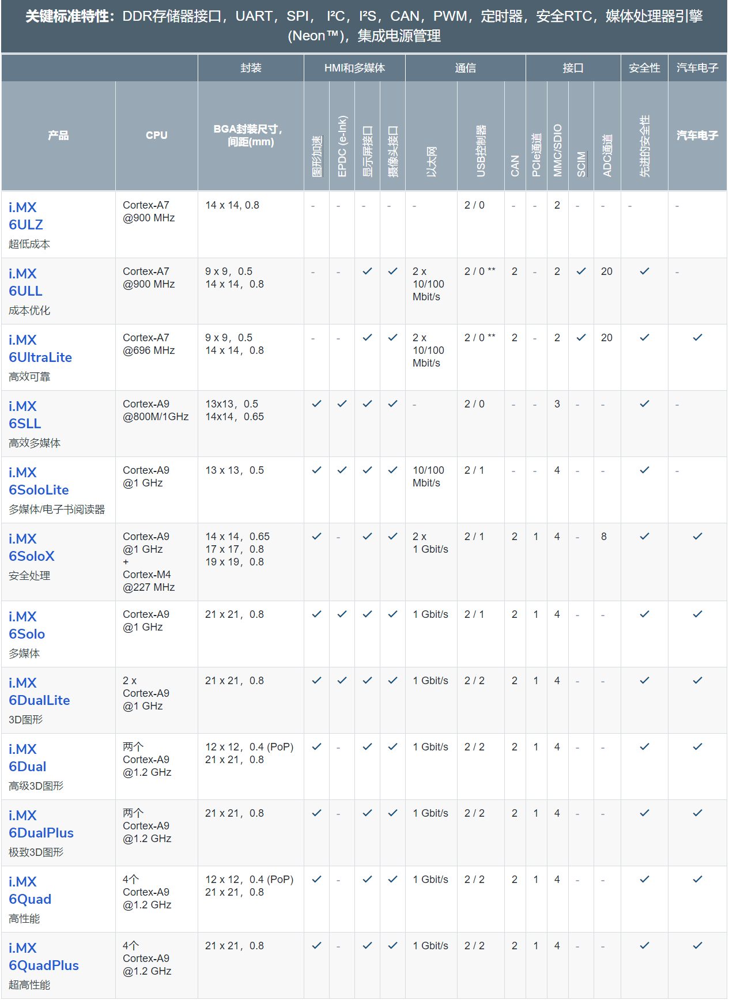

# nxp-imx6-notes
## 1.问题
```
    1.时钟配置
    2.中断配置（设备树）
    3.驱动加载（从设备树中读取配置）
    4.驱动加载顺序（时钟、cpu和各个设备）
    5.smarc定义（314pin）
    6.理解设备树描述（dts/dtsi->dtb->driver->device）
    7.设备树文件（dts和dtsi的调用关系）
    8.2.6内核和3.x内核区别（驱动加载，platform device 和 devicetreee）
```
## 2.imx6q参考手册(功能描述)
```
    1.介绍
    2.内存分布
    3.中断和dma
    4.引脚说明（信号和复用）
    5.引导启动位置
    6.外部内存控制器
        DDR:MMDC（multi mode ddr）
        Raw NAND flash:GPMI 、BCH40和APBH_DMA
        EIM-PSRAM/NOR flash controller/SRAM
        uSDhc
    7.系统调式
    8.boot 说明
    9.多媒体处理模块
    10.时钟和电源管理
    11.系统安全
    12.corte-A9平台说明（ARM）
    13.AHB到ip桥(AIPSTZ)
    14.AHB到APB(AHB-Bridge-DMA)
    15.异步采样率转换(ASRC) 
    16.数字音频复用器(AUDMUX)
    17.纠错加速器(BCH) 
    18.时钟控制模块(CCM)
    19.MIPI-CSI到IPC(CSI2IPU)
    20.显示完整性检查(DCIC) ???
    21.spi(ECSPI)
    22.扩展接口模块 EIM(PSRAM和NOR flash控制器)
    23.网络（ENET）
    24.电泳事电子纸面板(EPDC)（手写板）
    25.增强周期中断定时器(EPIT)
    26.增强串行音频接口(ESAI)
    27.can（FLXCAN）
    28.通用电源管理、中断相关(GPC)
    29.gpio
    30.GPMI(NAND FLASH)
    31.通用定时器(GPT)
    32.GPU2D 
    33.GPU3D 
    34.HDMI
    35.HDMI-PHY
    36.I2C
    37.io复用控制器（IOMUXC）
    38.图像处理单元 ipu
    39.键盘接口（KPP）
    40.lvds 显示(LDB)
    41.MIPI CSI 物理接口
    42.MIPI DSI 显示接口 
    43.MIPI HSI 
    44.mediaLB 
    45.mmdc（ddr）
    46.网络互联总线系统（NIC-301）
    47.片上一次编程控制器(OCOTP_CTRL)
    48.片上ram内存控制器(OCRAM)
    49.pcie
    50.pcie-phy
    51.电源管理单元(PMU)
    52.pwm
    53.像素(PXP) 
    54.rom控制器(ROMC)
    55.dma(SDMA)
    56.sjc 系统jtag(SJC)
    57.snvs???
    58.共享外设总线仲裁（SPBA）
    59.spdif
    60.src 系统复位控制器
    61.同步串行接口（SSI）
    62.温度检测(TEMPMON)
    63.信任地址空间控制器(TZASC)
    64.串口(UART)
    65.usb(USB)
    66.usb-phy
    67.sd卡（sd/mmc）uSDHC
    68.视频数据适配器(VDOA)
    69.视频处理单元(VPU)
    70.看门狗(WDOG)
    71.晶体振荡器(XTALOSC)
```
## 3.官方参考手册和设备树对应
```
    对照厂商（imx6）的dtsi文件与参考手册（RM），确定memory地址和寄存器地址
```
## 4.设备树原理(设备树语法和对应的源码)
* 4.1 查看对应的板级dts，可确定对应的外设和驱动使用情况，以及设备定义（/dev）
* 4.2 确定各类控制器（中断控制器、时钟控制器、spi控制器、i2c控制器等，以及描述方式，对照源码of来进一步查看）
* 4.3 dtsi和dts关系
```
例：凌华smarc板（imx6q）
    imx6qdl.dtsi（qdl系列相同的定义）->imx6q.dtsi(q系列专有定义)->lec-imx6.dtsi->lec-imx6q.dts
```
* 4.4 时钟->中断->外设等
* 4.5 [设备树pinctrl解析](https://www.cnblogs.com/fah936861121/articles/7085308.html)
## 5.bootloader
* 5.1 常见的bootloader
```
    uboot、vivi、grub
```
* 5.2 烧写uboot
```
    1.通过出厂工具（MfgTool）加载u-boot到所有支持的devices上（imx6和imx7），如spi norflash、sd卡、emmc灯等
    2.通过linux下的dd命令写到sd卡中
    3.通过已经存在的uboot进行加载（一些devices上）
```
* 5.3 uboot源码修改，编译
* 5.4 uboot启动位置选择
* 5.5 uboot常用指令
## 6.文件系统
* 6.1 下载文件系统源码（ext3、ext4、yaffs等）
* 6.2 文件系统制作
* 6.3 文件系统烧写
## 7.内核
* 7.1 内核源码下载
* 7.2 内核源码修改、编译
* 7.3 内核烧写
* 7.4 内核/文件系统启动位置选择和设定
* 7.5 驱动相关
* 7.6 Linux内核的五大模块 
```
1.进程调度模块
    用来负责控制进程对CPU 资源的使用。所采取的调度策略是各进程能够公平合理地访问CPU, 同时保证内核能及时地执行硬件操作。

2.内存管理模块
    用于确保所有进程能够安全地共享机器主内存区, 同时, 内存管理模块还支持虚拟内存管理方式, 使得Linux 支持进程使用比实际内存空间更多的内存容量。并可以利用文件系统, 对暂时不用的内存数据块交换到外部存储设备上去, 当需要时再交换回来。

3.文件系统模块
    用于支持对外部设备的驱动和存储。虚拟文件系统模块通过向所有的外部存储设备提供一个通用的文件接口,隐藏了各种硬件设备的不同细节。从而提供并支持与其它操作系统兼容的多种文件系统格式。

4.进程间通信模块
    用于支持多种进程间的信息交换方式

5.网络接口模块
    提供对多种网络通信标准的访问并支持许多网络硬件
```
* 7.7 发布内核补丁 patch
## 8.[启动位置选择](https://blog.csdn.net/Richard_WangJian/article/details/101983651)
```
    * Boot From Fuses
	* Serial Downloader
	* Internal Boot
```
## 9.驱动开发
* 9.1 开发环境
* 9.2 常用命令
* 9.3 编译工具链
* 9.4 调试工具和调试方法
* 9.5 同步方式
 	中断屏蔽、原子操作、信号量、RCU（read copy update）、自旋锁、读写锁、顺序锁等
* 9.6 常用外设和协议（spi、i2c、uart、usb、网络、nand、i2s等）
* 9.7 mmu
* 9.8 驱动框架
```
    i2c子系统
    spi子系统
    usb子系统（摄像头等）
    声卡子系统
    camer子系统
    网卡
    can
    framebuffer（lcd等）
    input

疑问1：
    为什么spi总线上spidev可以映射到/dev/spidev
    而i2c总线上的pca9535却映射不到/dev/下
疑问2：
    哪些可以生成/dev
    哪些可以/sys下设备节点，如gpio（export等）
疑问3：
    pca9535设备树中，好多设备都引用它的中断，是如何处理的
```
## 10.应用开发
* 10.1 进程间通信方式（管道/有名管道/共享内存/信号/信号量/消息队列/套接字），线程间互斥（互斥量/读写锁/条件变量等）
* 10.2 网络编程
* 10.3 文件操作（配置文件、json等）
* 10.4 文件属性、系统信息（时间、温度和proc等）
* 10.5 数据库
* 10.6 web cgi
* 10.7 poll、epoll、select
* 10.8 常用升级方式（内核/设备树、应用）
* 10.9 常用通信协议（xmodem、ymodem、ssh、scp、sftp、tftp、ftp、http等）
## 11.杂项
```
soc->引脚分配->设备树描述(设备定义等)->kernel修改->等待uboot加载
文件系统->制作文件系统->等待uboot加载
```
## 12.mfgtool
* [下载](https://www.nxp.com/products/processors-and-microcontrollers/arm-processors/i-mx-applications-processors/i-mx-6-processors/i-mx-6duallite-processors-dual-core-3d-graphics-hd-video-arm-cortex-a9-core:i.MX6DL?tab=Design_Tools_Tab)
* 使用
```
各个smarc板厂家提供的mfgtool不同，主要是里面的配置文件（vbs和ucl2.xml）以及mksdcard.sh.tar不同
```
## 13.NXP i.MX Pins Tool v2.0
* 下载 pins_tool_for_i.mx_processors
## 14.片上一次编程控制器(OCOTP_CTRL)
```
如：
    写死mac地址，需要指定fuse：HW_OCOTP_MAC0 fuse bank
```
## 15.[源码下载](https://blog.csdn.net/huohongpeng/article/details/106472024)
```
1.对比飞思卡尔和凌华4.1.15源码（凌华采用的是linux-2.6-imx.git分支）
    git.freescale.com/git/cgit.cgi/imx/linux-2.6-imx.git/snapshot/linux-2.6-imx-rel_imx_4.1.15_1.0.0_ga.tar.gz（凌华源码下载地址）
注：
    直接去找对应的branch，然后点进去，进行下载

2.查看凌华build_linux.sh，如何使用patch，使用哪一个patch（使用所有branch）
2.1 linux_LEC-iMX6_9.tar.xz（凌华自己的patch）
2.2 linux-2.6-imx-rel_imx_4.1.15_1.0.0_ga_git1 （freescale官方在4.1.15内核基础上的补丁 http://git.freescale.com/git/cgit.cgi/imx/linux-2.6-imx.git/log/?h=imx_4.1.15_1.0.0_ga）
2.3 linux-stable_4.1.15-31（4.1.15内核到4.1.30的补丁）
```
## 16.选型

## 